# Building AI Agents with Go and OpenRouter

> **Adapted from:** [Building Effective Agents](https://www.anthropic.com/engineering/building-effective-agents) by Erik Schluntz & Barry Zhang, and [The 7 Building Blocks of AI Agents](https://www.youtube.com/watch?v=building-blocks) by Dave Ebbelaar.
>
> **Language:** Go (1.24+) — **Provider:** [OpenRouter](https://openrouter.ai) (`/chat/completions`)

---

## Table of Contents

1. [Introduction — Why Go + OpenRouter?](#introduction--why-go--openrouter)
2. [Prerequisites](#prerequisites)
3. [Step 1 — The Foundation: Calling OpenRouter from Go](#step-1--the-foundation-calling-openrouter-from-go)
4. [Step 2 — Memory: Persisting Context Across Interactions](#step-2--memory-persisting-context-across-interactions)
5. [Step 3 — Tools: Letting the LLM Act on the World](#step-3--tools-letting-the-llm-act-on-the-world)
6. [Step 4 — Validation: Enforcing Structured Output](#step-4--validation-enforcing-structured-output)
7. [Step 5 — Control Flow: Deterministic Decision-Making](#step-5--control-flow-deterministic-decision-making)
8. [Step 6 — Recovery: Graceful Failure Management](#step-6--recovery-graceful-failure-management)
9. [Step 7 — Feedback: Human-in-the-Loop Approval](#step-7--feedback-human-in-the-loop-approval)
10. [Workflow Patterns — Composing the Blocks](#workflow-patterns--composing-the-blocks)
    - [Prompt Chaining](#pattern-a-prompt-chaining)
    - [Routing](#pattern-b-routing)
    - [Parallelization](#pattern-c-parallelization)
    - [Orchestrator-Workers](#pattern-d-orchestrator-workers)
    - [Evaluator-Optimizer](#pattern-e-evaluator-optimizer)
    - [Autonomous Agent Loop](#pattern-f-autonomous-agent-loop)
11. [Complete Example — Customer Support Agent](#complete-example--customer-support-agent)
12. [Production Guidelines](#production-guidelines)
13. [Appendix — Prompt Engineering Your Tools](#appendix--prompt-engineering-your-tools)

---

## Introduction — Why Go + OpenRouter?

Most successful AI agent implementations aren't using complex frameworks. They're building with **simple, composable patterns**. In this guide we replace the typical Python + Anthropic SDK setup with **Go** and the **OpenRouter API**, giving you:

| Benefit | Detail |
|---------|--------|
| **Performance** | Go's goroutines let you parallelise LLM calls with near-zero overhead. |
| **Type Safety** | Structs + `json` tags catch schema drift at compile time. |
| **Single Binary** | No virtualenv, no `pip install` — ship one statically-linked binary. |
| **Model Flexibility** | OpenRouter routes to 200+ models (Claude, GPT-4o, Gemini, Llama, Mistral, etc.) through a single OpenAI-compatible API. |

> **Core Principle:** An LLM API call is the most expensive and most dangerous operation in modern software.  
> Use it *only* when no deterministic code can solve the problem.

---

## Prerequisites

| Requirement | Version |
|-------------|---------|
| Go | ≥ 1.24 |
| OpenRouter API Key | [openrouter.ai/keys](https://openrouter.ai/keys) |

```bash
# Create the project
mkdir go-agent && cd go-agent
go mod init github.com/youruser/go-agent
```

Set your API key as an environment variable:

```bash
export OPENROUTER_API_KEY="sk-or-v1-..."
```

---

## Step 1 — The Foundation: Calling OpenRouter from Go

This is the **Intelligence** building block — the only truly "AI" component.  
Everything else is regular software engineering.

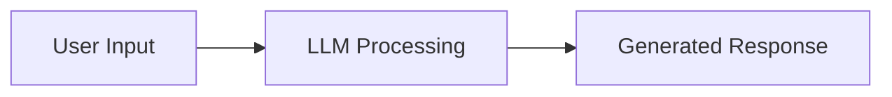

### 1.1  Define request / response types

These structs mirror the OpenRouter `/chat/completions` endpoint (see [OpenAPI spec](openapi.yaml)).

```go
// openrouter.go
package agent

import (
	"bytes"
	"context"
	"encoding/json"
	"fmt"
	"io"
	"net/http"
	"os"
)

const openRouterURL = "https://openrouter.ai/api/v1/chat/completions"

// Message represents a single message in the conversation.
type Message struct {
	Role       string          `json:"role"`                  // "system", "user", "assistant", "tool"
	Content    string          `json:"content,omitempty"`
	ToolCalls  []ToolCall      `json:"tool_calls,omitempty"`
	ToolCallID string          `json:"tool_call_id,omitempty"`
}

// ToolCall represents a tool invocation requested by the model.
type ToolCall struct {
	ID       string       `json:"id"`
	Type     string       `json:"type"` // always "function"
	Function FunctionCall `json:"function"`
}

// FunctionCall holds the function name and its JSON-encoded arguments.
type FunctionCall struct {
	Name      string `json:"name"`
	Arguments string `json:"arguments"`
}

// ToolDefinition describes a tool that the model can call.
type ToolDefinition struct {
	Type     string             `json:"type"` // "function"
	Function FunctionDefinition `json:"function"`
}

// FunctionDefinition describes the function signature.
type FunctionDefinition struct {
	Name        string      `json:"name"`
	Description string      `json:"description,omitempty"`
	Parameters  interface{} `json:"parameters,omitempty"`
}

// ChatRequest is the request body for /chat/completions.
type ChatRequest struct {
	Model       string           `json:"model"`
	Messages    []Message        `json:"messages"`
	Tools       []ToolDefinition `json:"tools,omitempty"`
	ToolChoice  interface{}      `json:"tool_choice,omitempty"`
	Temperature *float64         `json:"temperature,omitempty"`
	MaxTokens   *int             `json:"max_tokens,omitempty"`
	Stream      bool             `json:"stream,omitempty"`
}

// ChatResponse is the response from /chat/completions.
type ChatResponse struct {
	ID      string   `json:"id"`
	Choices []Choice `json:"choices"`
	Usage   Usage    `json:"usage"`
}

// Choice represents a single completion choice.
type Choice struct {
	Index        int     `json:"index"`
	Message      Message `json:"message"`
	FinishReason string  `json:"finish_reason"`
}

// Usage tracks token consumption.
type Usage struct {
	PromptTokens     int `json:"prompt_tokens"`
	CompletionTokens int `json:"completion_tokens"`
	TotalTokens      int `json:"total_tokens"`
}
```

### 1.2  Implement the client

```go
// client.go
package agent

// Client wraps the OpenRouter HTTP API.
type Client struct {
	apiKey     string
	httpClient *http.Client
	model      string
}

// NewClient creates a new OpenRouter client.
// Model examples: "anthropic/claude-sonnet-4-20250514", "openai/gpt-4o", "google/gemini-2.5-pro-preview"
func NewClient(model string) *Client {
	return &Client{
		apiKey:     os.Getenv("OPENROUTER_API_KEY"),
		httpClient: &http.Client{},
		model:      model,
	}
}

// Complete sends a chat completion request and returns the response.
func (c *Client) Complete(ctx context.Context, req ChatRequest) (*ChatResponse, error) {
	req.Model = c.model

	body, err := json.Marshal(req)
	if err != nil {
		return nil, fmt.Errorf("marshal request: %w", err)
	}

	httpReq, err := http.NewRequestWithContext(ctx, http.MethodPost, openRouterURL, bytes.NewReader(body))
	if err != nil {
		return nil, fmt.Errorf("create request: %w", err)
	}

	httpReq.Header.Set("Content-Type", "application/json")
	httpReq.Header.Set("Authorization", "Bearer "+c.apiKey)
	httpReq.Header.Set("HTTP-Referer", "https://github.com/youruser/go-agent")
	httpReq.Header.Set("X-Title", "Go Agent")

	resp, err := c.httpClient.Do(httpReq)
	if err != nil {
		return nil, fmt.Errorf("send request: %w", err)
	}
	defer resp.Body.Close()

	if resp.StatusCode != http.StatusOK {
		errBody, _ := io.ReadAll(resp.Body)
		return nil, fmt.Errorf("openrouter error %d: %s", resp.StatusCode, string(errBody))
	}

	var chatResp ChatResponse
	if err := json.NewDecoder(resp.Body).Decode(&chatResp); err != nil {
		return nil, fmt.Errorf("decode response: %w", err)
	}

	return &chatResp, nil
}
```

### 1.3  First call — "Hello, Agent!"

```go
// main.go
package main

import (
	"context"
	"fmt"
	"log"

	"github.com/youruser/go-agent/agent"
)

func main() {
	client := agent.NewClient("anthropic/claude-sonnet-4-20250514")

	resp, err := client.Complete(context.Background(), agent.ChatRequest{
		Messages: []agent.Message{
			{Role: "system", Content: "You are a helpful assistant."},
			{Role: "user", Content: "What are the building blocks of an AI agent?"},
		},
	})
	if err != nil {
		log.Fatal(err)
	}

	fmt.Println(resp.Choices[0].Message.Content)
}
```

> **Tip:** Change the model string to any OpenRouter-supported model without changing a single line of business logic.

---

## Step 2 — Memory: Persisting Context Across Interactions

LLMs are **stateless** — every call starts from scratch. You must manage conversation history yourself.

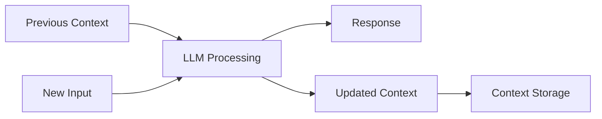

### 2.1  In-memory conversation store

```go
// memory.go
package agent

import "sync"

// ConversationMemory stores message history per session.
type ConversationMemory struct {
	mu       sync.RWMutex
	sessions map[string][]Message
}

// NewMemory creates a new conversation store.
func NewMemory() *ConversationMemory {
	return &ConversationMemory{sessions: make(map[string][]Message)}
}

// Append adds a message to the session history.
func (m *ConversationMemory) Append(sessionID string, msg Message) {
	m.mu.Lock()
	defer m.mu.Unlock()
	m.sessions[sessionID] = append(m.sessions[sessionID], msg)
}

// History returns the full message history for a session.
func (m *ConversationMemory) History(sessionID string) []Message {
	m.mu.RLock()
	defer m.mu.RUnlock()
	// Return a copy so callers can't mutate internal state.
	hist := make([]Message, len(m.sessions[sessionID]))
	copy(hist, m.sessions[sessionID])
	return hist
}

// Trim keeps only the last n messages (plus the system prompt).
func (m *ConversationMemory) Trim(sessionID string, keepLast int) {
	m.mu.Lock()
	defer m.mu.Unlock()
	msgs := m.sessions[sessionID]
	if len(msgs) <= keepLast+1 {
		return
	}
	// Always keep the first message (system prompt) + last N.
	trimmed := make([]Message, 0, keepLast+1)
	trimmed = append(trimmed, msgs[0])
	trimmed = append(trimmed, msgs[len(msgs)-keepLast:]...)
	m.sessions[sessionID] = trimmed
}
```

### 2.2  Using memory in a conversation loop

```go
func conversationLoop(client *agent.Client, mem *agent.ConversationMemory, sessionID string) {
	// Set the system prompt once.
	mem.Append(sessionID, agent.Message{
		Role:    "system",
		Content: "You are a helpful customer support agent for Leal.",
	})

	scanner := bufio.NewScanner(os.Stdin)
	for {
		fmt.Print("You: ")
		if !scanner.Scan() {
			break
		}
		userInput := scanner.Text()

		mem.Append(sessionID, agent.Message{Role: "user", Content: userInput})

		resp, err := client.Complete(context.Background(), agent.ChatRequest{
			Messages: mem.History(sessionID),
		})
		if err != nil {
			log.Printf("error: %v", err)
			continue
		}

		assistant := resp.Choices[0].Message
		mem.Append(sessionID, assistant)

		fmt.Printf("Agent: %s\n", assistant.Content)
	}
}
```

---

## Step 3 — Tools: Letting the LLM Act on the World

Tools let the LLM say *"I need to call this function with these parameters"* — your code handles the actual execution.

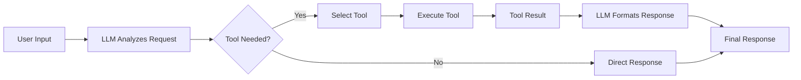

### 3.1  Define a tool registry

```go
// tools.go
package agent

import (
	"context"
	"encoding/json"
	"fmt"
)

// ToolHandler is a function that executes a tool and returns a string result.
type ToolHandler func(ctx context.Context, args json.RawMessage) (string, error)

// ToolRegistry maps tool names to their definitions and handlers.
type ToolRegistry struct {
	definitions map[string]ToolDefinition
	handlers    map[string]ToolHandler
}

// NewToolRegistry creates a new empty registry.
func NewToolRegistry() *ToolRegistry {
	return &ToolRegistry{
		definitions: make(map[string]ToolDefinition),
		handlers:    make(map[string]ToolHandler),
	}
}

// Register adds a tool to the registry.
func (r *ToolRegistry) Register(def ToolDefinition, handler ToolHandler) {
	r.definitions[def.Function.Name] = def
	r.handlers[def.Function.Name] = handler
}

// Definitions returns all tool definitions for the API request.
func (r *ToolRegistry) Definitions() []ToolDefinition {
	defs := make([]ToolDefinition, 0, len(r.definitions))
	for _, d := range r.definitions {
		defs = append(defs, d)
	}
	return defs
}

// Execute runs the named tool with the given arguments.
func (r *ToolRegistry) Execute(ctx context.Context, name string, args json.RawMessage) (string, error) {
	handler, ok := r.handlers[name]
	if !ok {
		return "", fmt.Errorf("unknown tool: %s", name)
	}
	return handler(ctx, args)
}
```

### 3.2  Register a concrete tool

```go
// tools_weather.go
package agent

import (
	"context"
	"encoding/json"
	"fmt"
)

func RegisterWeatherTool(registry *ToolRegistry) {
	def := ToolDefinition{
		Type: "function",
		Function: FunctionDefinition{
			Name:        "get_weather",
			Description: "Get the current weather for a location.",
			Parameters: map[string]interface{}{
				"type": "object",
				"properties": map[string]interface{}{
					"location": map[string]interface{}{
						"type":        "string",
						"description": "City name, e.g. 'Bogotá, CO'",
					},
					"unit": map[string]interface{}{
						"type": "string",
						"enum": []string{"celsius", "fahrenheit"},
					},
				},
				"required": []string{"location"},
			},
		},
	}

	handler := func(ctx context.Context, args json.RawMessage) (string, error) {
		var params struct {
			Location string `json:"location"`
			Unit     string `json:"unit"`
		}
		if err := json.Unmarshal(args, &params); err != nil {
			return "", fmt.Errorf("parse args: %w", err)
		}
		if params.Unit == "" {
			params.Unit = "celsius"
		}
		// In production, call a real weather API here.
		return fmt.Sprintf(`{"location": "%s", "temperature": 22, "unit": "%s", "condition": "sunny"}`,
			params.Location, params.Unit), nil
	}

	registry.Register(def, handler)
}
```

### 3.3  The tool execution loop

When the model returns `tool_calls`, you must execute each one and feed results back:

```go
// agent_loop.go
package agent

import (
	"context"
	"encoding/json"
	"fmt"
)

// RunWithTools executes a full conversation turn, handling any tool calls.
func RunWithTools(ctx context.Context, client *Client, registry *ToolRegistry, messages []Message) (*Message, error) {
	req := ChatRequest{
		Messages: messages,
		Tools:    registry.Definitions(),
	}

	for {
		resp, err := client.Complete(ctx, req)
		if err != nil {
			return nil, err
		}

		assistantMsg := resp.Choices[0].Message

		// If no tool calls, we're done — return the final response.
		if len(assistantMsg.ToolCalls) == 0 {
			return &assistantMsg, nil
		}

		// Append the assistant message with tool_calls to history.
		req.Messages = append(req.Messages, assistantMsg)

		// Execute each tool call and append the results.
		for _, tc := range assistantMsg.ToolCalls {
			result, err := registry.Execute(ctx, tc.Function.Name, json.RawMessage(tc.Function.Arguments))
			if err != nil {
				result = fmt.Sprintf(`{"error": "%s"}`, err.Error())
			}

			req.Messages = append(req.Messages, Message{
				Role:       "tool",
				Content:    result,
				ToolCallID: tc.ID,
			})
		}
		// Loop back — the model will see the tool results and generate a final answer.
	}
}
```

---

## Step 4 — Validation: Enforcing Structured Output

LLMs are probabilistic — you must **validate** that their JSON output matches your expected schema.

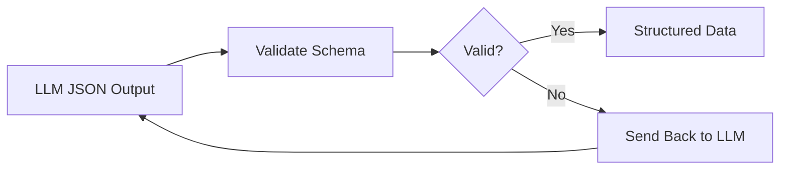

### 4.1  Schema validation with retry

```go
// validation.go
package agent

import (
	"context"
	"encoding/json"
	"fmt"
)

// ValidateAndRetry asks the LLM for JSON matching the target type T.
// If validation fails, it sends the error back to the LLM (up to maxRetries).
func ValidateAndRetry[T any](
	ctx context.Context,
	client *Client,
	messages []Message,
	maxRetries int,
) (*T, error) {
	currentMessages := make([]Message, len(messages))
	copy(currentMessages, messages)

	for attempt := 0; attempt <= maxRetries; attempt++ {
		resp, err := client.Complete(ctx, ChatRequest{Messages: currentMessages})
		if err != nil {
			return nil, fmt.Errorf("completion failed: %w", err)
		}

		content := resp.Choices[0].Message.Content

		var result T
		if err := json.Unmarshal([]byte(content), &result); err != nil {
			if attempt == maxRetries {
				return nil, fmt.Errorf("validation failed after %d retries: %w", maxRetries, err)
			}
			// Send the error back so the LLM can fix its output.
			currentMessages = append(currentMessages,
				Message{Role: "assistant", Content: content},
				Message{
					Role:    "user",
					Content: fmt.Sprintf("Your response was not valid JSON. Error: %s. Please fix it and respond with ONLY valid JSON.", err.Error()),
				},
			)
			continue
		}

		return &result, nil
	}

	return nil, fmt.Errorf("unreachable")
}
```

### 4.2  Usage example — extracting structured data

```go
type SentimentResult struct {
	Sentiment  string  `json:"sentiment"`  // "positive", "negative", "neutral"
	Confidence float64 `json:"confidence"` // 0.0 - 1.0
	Reasoning  string  `json:"reasoning"`
}

func analyzeSentiment(ctx context.Context, client *agent.Client, text string) (*SentimentResult, error) {
	messages := []agent.Message{
		{
			Role: "system",
			Content: `Analyze the sentiment of the given text.
Respond with ONLY a JSON object with these fields:
- sentiment: "positive", "negative", or "neutral"
- confidence: a float between 0 and 1
- reasoning: brief explanation`,
		},
		{Role: "user", Content: text},
	}

	return agent.ValidateAndRetry[SentimentResult](ctx, client, messages, 2)
}
```

> **Tip:** Use OpenRouter's `response_format: { "type": "json_object" }` for models that support it to increase reliability.

---

## Step 5 — Control Flow: Deterministic Decision-Making

**Don't let the LLM make every decision.** Use regular Go code for routing, branching, and orchestration.

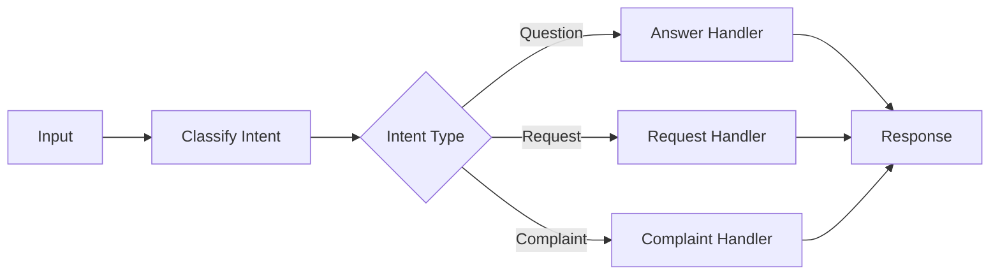

### 5.1  Intent-based routing

```go
// router.go
package agent

import (
	"context"
	"fmt"
)

// IntentType represents a classified user intent.
type IntentType string

const (
	IntentQuestion  IntentType = "question"
	IntentRefund    IntentType = "refund"
	IntentComplaint IntentType = "complaint"
	IntentUnknown   IntentType = "unknown"
)

type IntentClassification struct {
	Intent IntentType `json:"intent"`
}

// ClassifyIntent uses a fast model to classify user intent.
func ClassifyIntent(ctx context.Context, client *Client, userMessage string) (IntentType, error) {
	messages := []Message{
		{
			Role: "system",
			Content: `Classify the user's intent into exactly one category.
Respond with ONLY a JSON object: {"intent": "<category>"}
Categories: "question", "refund", "complaint", "unknown"`,
		},
		{Role: "user", Content: userMessage},
	}

	result, err := ValidateAndRetry[IntentClassification](ctx, client, messages, 1)
	if err != nil {
		return IntentUnknown, err
	}
	return result.Intent, nil
}

// RouteByIntent dispatches the user message to the right handler.
func RouteByIntent(ctx context.Context, client *Client, intent IntentType, userMessage string) (string, error) {
	var systemPrompt string

	switch intent {
	case IntentQuestion:
		systemPrompt = "You are a helpful FAQ assistant. Answer questions clearly and concisely."
	case IntentRefund:
		systemPrompt = "You are a refund specialist. Help the user process their refund request. Be empathetic."
	case IntentComplaint:
		systemPrompt = "You are a customer care specialist. Acknowledge the issue and propose a resolution."
	default:
		systemPrompt = "You are a helpful assistant. Try to understand what the user needs."
	}

	resp, err := client.Complete(ctx, ChatRequest{
		Messages: []Message{
			{Role: "system", Content: systemPrompt},
			{Role: "user", Content: userMessage},
		},
	})
	if err != nil {
		return "", fmt.Errorf("route response: %w", err)
	}

	return resp.Choices[0].Message.Content, nil
}
```

---

## Step 6 — Recovery: Graceful Failure Management

APIs go down. LLMs return nonsense. Rate limits hit you. **Plan for failure.**

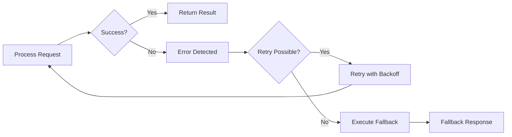

### 6.1  Retry with exponential backoff

```go
// recovery.go
package agent

import (
	"context"
	"fmt"
	"math"
	"math/rand"
	"time"
)

// RetryConfig controls retry behavior.
type RetryConfig struct {
	MaxRetries  int
	BaseDelay   time.Duration
	MaxDelay    time.Duration
	RetryableErrors func(error) bool
}

// DefaultRetryConfig returns sensible defaults.
func DefaultRetryConfig() RetryConfig {
	return RetryConfig{
		MaxRetries: 3,
		BaseDelay:  500 * time.Millisecond,
		MaxDelay:   30 * time.Second,
		RetryableErrors: func(err error) bool {
			return true // retry all errors by default
		},
	}
}

// WithRetry executes fn with exponential backoff + jitter.
func WithRetry[T any](ctx context.Context, cfg RetryConfig, fn func(ctx context.Context) (T, error)) (T, error) {
	var zero T

	for attempt := 0; attempt <= cfg.MaxRetries; attempt++ {
		result, err := fn(ctx)
		if err == nil {
			return result, nil
		}

		if attempt == cfg.MaxRetries || !cfg.RetryableErrors(err) {
			return zero, fmt.Errorf("failed after %d attempts: %w", attempt+1, err)
		}

		// Exponential backoff with jitter.
		delay := time.Duration(float64(cfg.BaseDelay) * math.Pow(2, float64(attempt)))
		if delay > cfg.MaxDelay {
			delay = cfg.MaxDelay
		}
		jitter := time.Duration(rand.Int63n(int64(delay / 2)))
		delay += jitter

		select {
		case <-ctx.Done():
			return zero, ctx.Err()
		case <-time.After(delay):
			// continue to next attempt
		}
	}

	return zero, fmt.Errorf("unreachable")
}
```

### 6.2  Using retry in your agent

```go
func safeComplete(ctx context.Context, client *agent.Client, req agent.ChatRequest) (*agent.ChatResponse, error) {
	return agent.WithRetry(ctx, agent.DefaultRetryConfig(), func(ctx context.Context) (*agent.ChatResponse, error) {
		return client.Complete(ctx, req)
	})
}
```

---

## Step 7 — Feedback: Human-in-the-Loop Approval

Some decisions are **too important for full automation** — sending emails, making purchases, processing refunds.

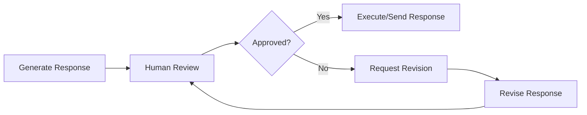

### 7.1  Approval workflow

```go
// feedback.go
package agent

import (
	"bufio"
	"context"
	"fmt"
	"os"
	"strings"
)

// ApprovalResult represents a human decision.
type ApprovalResult struct {
	Approved bool
	Feedback string
}

// RequestApproval pauses execution and asks for human review.
func RequestApproval(action, details string) ApprovalResult {
	fmt.Printf("\n🔔 APPROVAL REQUIRED\n")
	fmt.Printf("Action:  %s\n", action)
	fmt.Printf("Details: %s\n", details)
	fmt.Printf("Approve? (y/n/feedback): ")

	scanner := bufio.NewScanner(os.Stdin)
	if !scanner.Scan() {
		return ApprovalResult{Approved: false, Feedback: "no input received"}
	}

	input := strings.TrimSpace(scanner.Text())
	switch strings.ToLower(input) {
	case "y", "yes":
		return ApprovalResult{Approved: true}
	case "n", "no":
		return ApprovalResult{Approved: false, Feedback: "rejected by human"}
	default:
		return ApprovalResult{Approved: false, Feedback: input}
	}
}

// RunWithApproval wraps an action with human approval.
func RunWithApproval(
	ctx context.Context,
	client *Client,
	action string,
	draft string,
	maxRevisions int,
) (string, error) {
	currentDraft := draft

	for i := 0; i < maxRevisions; i++ {
		result := RequestApproval(action, currentDraft)
		if result.Approved {
			return currentDraft, nil
		}

		// Ask the LLM to revise based on feedback.
		resp, err := client.Complete(ctx, ChatRequest{
			Messages: []Message{
				{Role: "system", Content: "Revise the following draft based on the feedback provided."},
				{Role: "user", Content: fmt.Sprintf("Draft:\n%s\n\nFeedback:\n%s", currentDraft, result.Feedback)},
			},
		})
		if err != nil {
			return "", err
		}

		currentDraft = resp.Choices[0].Message.Content
	}

	return "", fmt.Errorf("max revisions (%d) exceeded without approval", maxRevisions)
}
```

---

## Workflow Patterns — Composing the Blocks

Now that you have the seven building blocks, here's how to **compose** them into powerful workflow patterns.

---

### Pattern A: Prompt Chaining

Decompose a task into sequential steps. Each LLM call processes the output of the previous one.

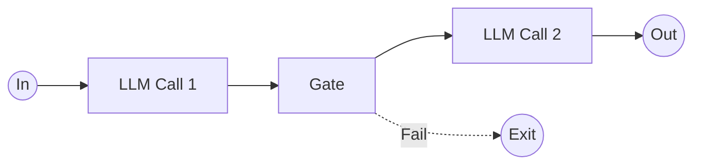

**When to use:** The task is cleanly decomposable into fixed subtasks.

```go
// chaining.go
package agent

import "context"

// ChainStep represents one step in a prompt chain.
type ChainStep struct {
	SystemPrompt string
	Gate         func(output string) (bool, error) // returns false to abort
}

// RunChain executes a sequence of LLM calls, passing each output to the next.
func RunChain(ctx context.Context, client *Client, input string, steps []ChainStep) (string, error) {
	current := input

	for i, step := range steps {
		resp, err := client.Complete(ctx, ChatRequest{
			Messages: []Message{
				{Role: "system", Content: step.SystemPrompt},
				{Role: "user", Content: current},
			},
		})
		if err != nil {
			return "", err
		}

		current = resp.Choices[0].Message.Content

		// Apply the gate if present.
		if step.Gate != nil {
			pass, err := step.Gate(current)
			if err != nil {
				return "", err
			}
			if !pass {
				return "", fmt.Errorf("chain aborted at step %d: gate check failed", i+1)
			}
		}
	}

	return current, nil
}
```

**Example — generate marketing copy then translate:**

```go
result, err := agent.RunChain(ctx, client, "Product: Leal loyalty rewards app", []agent.ChainStep{
	{SystemPrompt: "Write compelling marketing copy for the given product. Keep it under 100 words."},
	{
		SystemPrompt: "Translate the following marketing copy to Spanish. Keep the same tone and style.",
		Gate: func(output string) (bool, error) {
			return len(output) > 10, nil // basic sanity check
		},
	},
})
```

---

### Pattern B: Routing

Classify the input and direct it to a specialized handler.

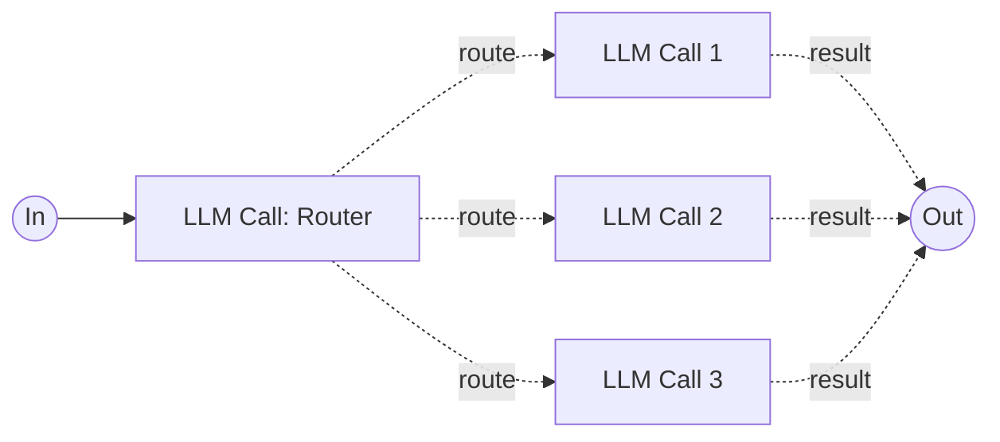

**When to use:** Distinct categories are better handled separately.

> See [Step 5 — Control Flow](#step-5--control-flow-deterministic-decision-making) for a full Go implementation.

**Tip:** Use a cheaper/faster model (e.g. `google/gemini-2.0-flash-001`) for classification, then route to a more capable model for the actual work.

---

### Pattern C: Parallelization

Run multiple LLM calls concurrently using **goroutines**.

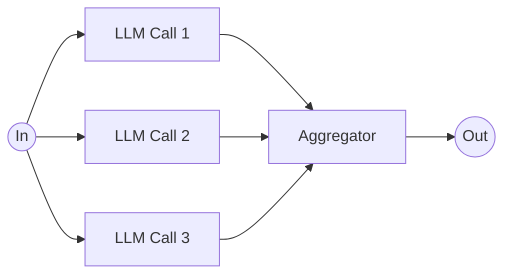

**When to use:** Independent subtasks can run in parallel, or you want multiple perspectives (voting).

```go
// parallel.go
package agent

import (
	"context"
	"sync"
)

// ParallelResult holds the output from one parallel LLM call.
type ParallelResult struct {
	Index  int
	Output string
	Err    error
}

// RunParallel executes multiple LLM prompts concurrently.
func RunParallel(ctx context.Context, client *Client, prompts []string, systemPrompt string) []ParallelResult {
	results := make([]ParallelResult, len(prompts))
	var wg sync.WaitGroup

	for i, prompt := range prompts {
		wg.Add(1)
		go func(idx int, p string) {
			defer wg.Done()

			resp, err := client.Complete(ctx, ChatRequest{
				Messages: []Message{
					{Role: "system", Content: systemPrompt},
					{Role: "user", Content: p},
				},
			})
			if err != nil {
				results[idx] = ParallelResult{Index: idx, Err: err}
				return
			}

			results[idx] = ParallelResult{
				Index:  idx,
				Output: resp.Choices[0].Message.Content,
			}
		}(i, prompt)
	}

	wg.Wait()
	return results
}
```

**Example — parallel code review (voting):**

```go
reviewPrompts := []string{
	"Review this code for security vulnerabilities:\n" + code,
	"Review this code for performance issues:\n" + code,
	"Review this code for maintainability and best practices:\n" + code,
}

results := agent.RunParallel(ctx, client, reviewPrompts, "You are an expert Go code reviewer.")

for _, r := range results {
	if r.Err != nil {
		log.Printf("Review %d failed: %v", r.Index, r.Err)
		continue
	}
	fmt.Printf("--- Review %d ---\n%s\n\n", r.Index+1, r.Output)
}
```

---

### Pattern D: Orchestrator-Workers

A central LLM dynamically breaks down tasks and delegates to workers.

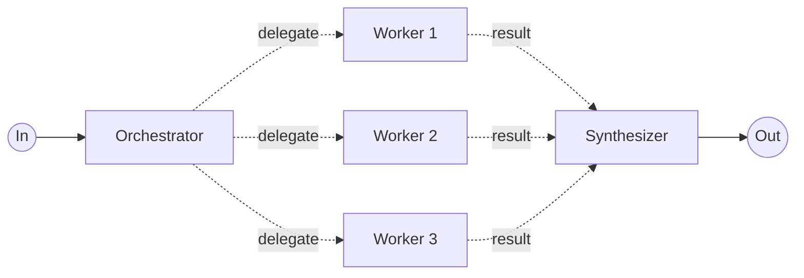

**When to use:** You can't predict the subtasks ahead of time.

```go
// orchestrator.go
package agent

import (
	"context"
	"fmt"
	"strings"
)

// Subtask represents a dynamically generated subtask.
type Subtask struct {
	ID          string `json:"id"`
	Description string `json:"description"`
}

// OrchestratorPlan is the LLM's plan for breaking down a task.
type OrchestratorPlan struct {
	Subtasks []Subtask `json:"subtasks"`
}

// RunOrchestrator breaks down a complex task, runs workers in parallel, and synthesizes results.
func RunOrchestrator(ctx context.Context, client *Client, task string) (string, error) {
	// Step 1: Ask the orchestrator to break down the task.
	planMessages := []Message{
		{
			Role: "system",
			Content: `Break down the given task into independent subtasks.
Respond with ONLY a JSON object: {"subtasks": [{"id": "1", "description": "..."}, ...]}
Create between 2-5 subtasks. Each should be independently solvable.`,
		},
		{Role: "user", Content: task},
	}

	plan, err := ValidateAndRetry[OrchestratorPlan](ctx, client, planMessages, 2)
	if err != nil {
		return "", fmt.Errorf("orchestrator planning: %w", err)
	}

	// Step 2: Run workers in parallel.
	prompts := make([]string, len(plan.Subtasks))
	for i, st := range plan.Subtasks {
		prompts[i] = st.Description
	}

	results := RunParallel(ctx, client, prompts, "Complete the following subtask thoroughly and concisely.")

	// Step 3: Synthesize results.
	var synthesis strings.Builder
	synthesis.WriteString(fmt.Sprintf("Original task: %s\n\nSubtask results:\n", task))
	for _, r := range results {
		if r.Err != nil {
			synthesis.WriteString(fmt.Sprintf("- Subtask %d: ERROR: %v\n", r.Index+1, r.Err))
		} else {
			synthesis.WriteString(fmt.Sprintf("- Subtask %d: %s\n", r.Index+1, r.Output))
		}
	}

	resp, err := client.Complete(ctx, ChatRequest{
		Messages: []Message{
			{Role: "system", Content: "Synthesize the subtask results into a coherent final answer for the original task."},
			{Role: "user", Content: synthesis.String()},
		},
	})
	if err != nil {
		return "", fmt.Errorf("synthesis: %w", err)
	}

	return resp.Choices[0].Message.Content, nil
}
```

---

### Pattern E: Evaluator-Optimizer

One LLM generates, another evaluates — looping until the output is accepted.

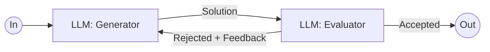

**When to use:** Clear evaluation criteria exist and iterative refinement adds measurable value.

```go
// evaluator.go
package agent

import (
	"context"
	"fmt"
)

// Evaluation holds the evaluator's judgement.
type Evaluation struct {
	Accepted bool   `json:"accepted"`
	Feedback string `json:"feedback"`
	Score    int    `json:"score"` // 1-10
}

// RunEvaluatorOptimizer generates and refines a response iteratively.
func RunEvaluatorOptimizer(
	ctx context.Context,
	client *Client,
	task string,
	evalCriteria string,
	maxIterations int,
) (string, error) {
	generatorPrompt := fmt.Sprintf("Complete the following task:\n%s", task)
	current := generatorPrompt

	for i := 0; i < maxIterations; i++ {
		// Generate.
		genResp, err := client.Complete(ctx, ChatRequest{
			Messages: []Message{
				{Role: "system", Content: "You are an expert writer. Produce high-quality output."},
				{Role: "user", Content: current},
			},
		})
		if err != nil {
			return "", err
		}
		generated := genResp.Choices[0].Message.Content

		// Evaluate.
		evalMessages := []Message{
			{
				Role: "system",
				Content: fmt.Sprintf(`Evaluate the following output against these criteria:
%s

Respond with ONLY a JSON object:
{"accepted": true/false, "feedback": "...", "score": 1-10}`, evalCriteria),
			},
			{Role: "user", Content: generated},
		}

		eval, err := ValidateAndRetry[Evaluation](ctx, client, evalMessages, 1)
		if err != nil {
			return generated, nil // Return the last generation on eval failure.
		}

		if eval.Accepted || eval.Score >= 8 {
			return generated, nil
		}

		// Prepare next iteration with feedback.
		current = fmt.Sprintf("Original task: %s\n\nPrevious attempt:\n%s\n\nFeedback:\n%s\n\nPlease improve based on the feedback.",
			task, generated, eval.Feedback)
	}

	return "", fmt.Errorf("max iterations (%d) reached without acceptance", maxIterations)
}
```

---

### Pattern F: Autonomous Agent Loop

The LLM operates in a **loop**, using tools based on environmental feedback until it decides the task is complete.

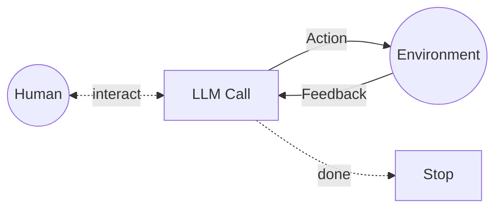

**When to use:** Open-ended problems where you can't predict the number of steps.

```go
// autonomous.go
package agent

import (
	"context"
	"fmt"
	"log"
)

// AgentConfig configures the autonomous agent loop.
type AgentConfig struct {
	SystemPrompt  string
	MaxIterations int
	Client        *Client
	Registry      *ToolRegistry
}

// RunAutonomousAgent runs the agent loop until task completion or max iterations.
func RunAutonomousAgent(ctx context.Context, cfg AgentConfig, userTask string) (string, error) {
	messages := []Message{
		{Role: "system", Content: cfg.SystemPrompt},
		{Role: "user", Content: userTask},
	}

	for i := 0; i < cfg.MaxIterations; i++ {
		log.Printf("Agent iteration %d/%d", i+1, cfg.MaxIterations)

		resp, err := cfg.Client.Complete(ctx, ChatRequest{
			Messages: messages,
			Tools:    cfg.Registry.Definitions(),
		})
		if err != nil {
			return "", fmt.Errorf("iteration %d: %w", i+1, err)
		}

		assistant := resp.Choices[0].Message

		// No tool calls ⇒ the agent considers the task complete.
		if len(assistant.ToolCalls) == 0 {
			return assistant.Content, nil
		}

		messages = append(messages, assistant)

		// Execute all tool calls.
		for _, tc := range assistant.ToolCalls {
			result, err := cfg.Registry.Execute(ctx, tc.Function.Name, []byte(tc.Function.Arguments))
			if err != nil {
				result = fmt.Sprintf(`{"error": "%s"}`, err.Error())
			}

			messages = append(messages, Message{
				Role:       "tool",
				Content:    result,
				ToolCallID: tc.ID,
			})
		}
	}

	return "", fmt.Errorf("agent did not complete within %d iterations", cfg.MaxIterations)
}
```

---

## Complete Example — Customer Support Agent

Putting it all together: a customer support agent that classifies intent, uses tools, requires approval for refunds, and handles errors gracefully.

```go
package main

import (
	"context"
	"fmt"
	"log"

	"github.com/youruser/go-agent/agent"
)

func main() {
	// Use a capable model via OpenRouter.
	client := agent.NewClient("anthropic/claude-sonnet-4-20250514")
	memory := agent.NewMemory()
	registry := agent.NewToolRegistry()

	// Register tools.
	agent.RegisterWeatherTool(registry)
	// ... register more tools (lookup_order, issue_refund, etc.)

	sessionID := "session-001"
	memory.Append(sessionID, agent.Message{
		Role:    "system",
		Content: "You are a helpful customer support agent for Leal. Be empathetic and solution-oriented.",
	})

	ctx := context.Background()
	userMessage := "I want a refund for my last order, it arrived damaged."

	// Step 1: Classify intent (fast model).
	routerClient := agent.NewClient("google/gemini-2.0-flash-001")
	intent, err := agent.ClassifyIntent(ctx, routerClient, userMessage)
	if err != nil {
		log.Fatal(err)
	}
	fmt.Printf("Classified intent: %s\n", intent)

	// Step 2: Handle based on intent.
	memory.Append(sessionID, agent.Message{Role: "user", Content: userMessage})

	response, err := agent.RunWithTools(ctx, client, registry, memory.History(sessionID))
	if err != nil {
		log.Fatal(err)
	}

	// Step 3: If it's a refund, require human approval.
	if intent == agent.IntentRefund {
		approved, err := agent.RunWithApproval(ctx, client, "Process refund", response.Content, 3)
		if err != nil {
			log.Fatal(err)
		}
		fmt.Printf("Approved response:\n%s\n", approved)
	} else {
		fmt.Printf("Agent: %s\n", response.Content)
	}

	memory.Append(sessionID, *response)
}
```

---

## Production Guidelines

| Area | Recommendation |
|------|----------------|
| **Start Simple** | Begin with single LLM calls + good prompts. Only add patterns when they demonstrably improve outcomes. |
| **Model Selection** | Use OpenRouter's model routing — cheap models for classification, capable ones for generation. |
| **Cost Control** | Set `max_tokens`, use `provider.max_price` in the request, monitor via `/credits`. |
| **Observability** | Use the `trace` field in `ChatRequest` for distributed tracing with your APM tool. |
| **Rate Limits** | Implement the retry/backoff pattern from Step 6 for all LLM calls. |
| **Testing** | Test individual building blocks in isolation. Mock the OpenRouter client for unit tests. |
| **Context Window** | Use the `Trim` method on memory to stay within model limits. |
| **Concurrency** | Go's goroutines + `sync.WaitGroup` make parallelization trivial — use it. |
| **Transparency** | Log the LLM's reasoning/planning steps — don't hide them from operators. |
| **Sandboxing** | Run autonomous agents in sandboxed environments with guardrails (max iterations, timeouts, approval gates). |

---

## Appendix — Prompt Engineering Your Tools

No matter which agentic system you're building, **tools are a critical part of your agent**. How you define them is as important as your prompts.

### Key Principles

1. **Put yourself in the model's shoes.** Is it obvious how to use this tool from the description alone? A good tool definition includes:
   - Example usage
   - Edge cases
   - Input format requirements
   - Clear boundaries from other tools

2. **Descriptive parameter names matter.** Think of each tool definition as writing a docstring for a junior developer:

   ```go
   // ❌ Bad
   FunctionDefinition{Name: "proc", Parameters: map[string]any{"d": "...", "t": "..."}}

   // ✅ Good
   FunctionDefinition{
       Name:        "process_refund",
       Description: "Process a refund for a customer order. Only use when the customer explicitly requests a refund.",
       Parameters: map[string]any{
           "order_id":  "The unique order identifier (e.g. 'ORD-12345')",
           "reason":    "The reason for the refund: 'damaged', 'wrong_item', 'not_received'",
           "amount":    "Refund amount in USD. Must not exceed the original order total.",
       },
   }
   ```

3. **Use absolute paths, not relative.** If your tool works with files, require absolute paths — LLMs get confused with relative paths after navigating directories.

4. **Poka-yoke your tools.** Design parameters so it's *hard* to make mistakes:
   - Use enums instead of free-text where possible
   - Validate inputs before execution
   - Return clear error messages that help the LLM self-correct

5. **Test how the model uses your tools.** Run many example inputs to see what mistakes the model makes, and iterate on your definitions.

> **Pro tip:** Invest more time in optimizing your tool definitions than your overall prompt. In practice, well-defined tools have a bigger impact on agent reliability than prompt engineering alone.

---

## OpenRouter-Specific Features

### Model Routing

OpenRouter lets you route to the best model automatically:

```go
req := agent.ChatRequest{
	Model: "openrouter/auto", // Let OpenRouter pick the best model
	Messages: messages,
}
```

### Provider Preferences

Control which providers serve your requests:

```go
// In your ChatRequest, you can add provider preferences
// by extending the struct with the Provider field:
type ProviderPrefs struct {
	Order         []string `json:"order,omitempty"`
	AllowFallbacks *bool   `json:"allow_fallbacks,omitempty"`
}
```

### Cost Tracking

Monitor your spending via the `/credits` endpoint:

```go
func checkCredits(apiKey string) {
	req, _ := http.NewRequest("GET", "https://openrouter.ai/api/v1/credits", nil)
	req.Header.Set("Authorization", "Bearer "+apiKey)
	// ... execute and parse the response
}
```

---

*Built with ❤️ using Go and [OpenRouter](https://openrouter.ai). Adapted for the Leal engineering team.*
