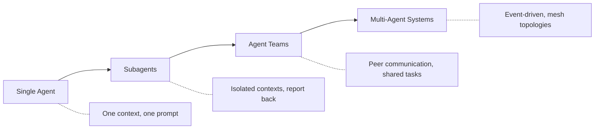
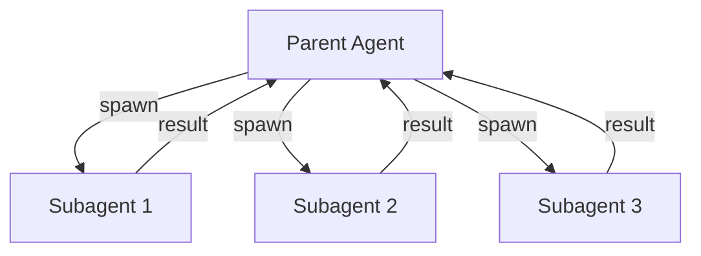
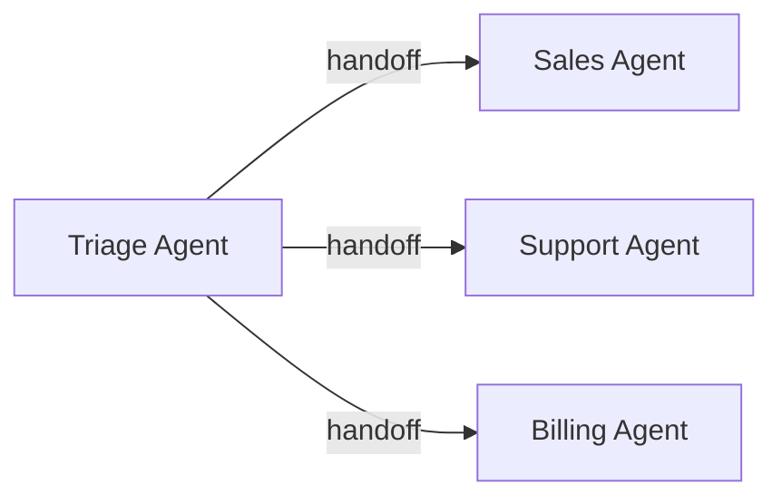
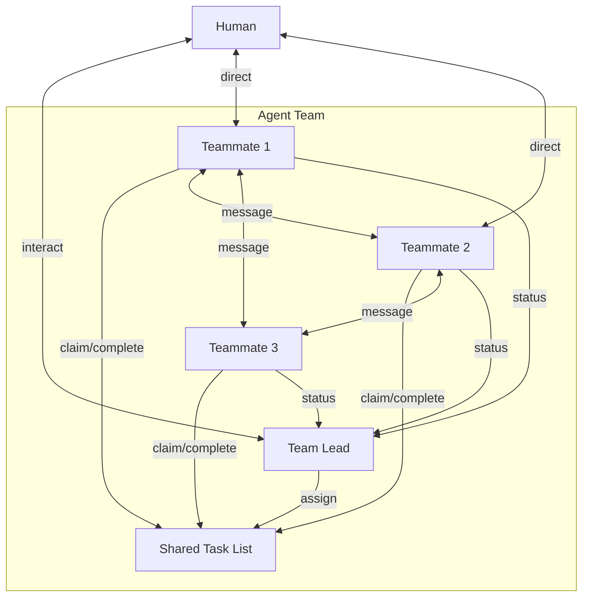
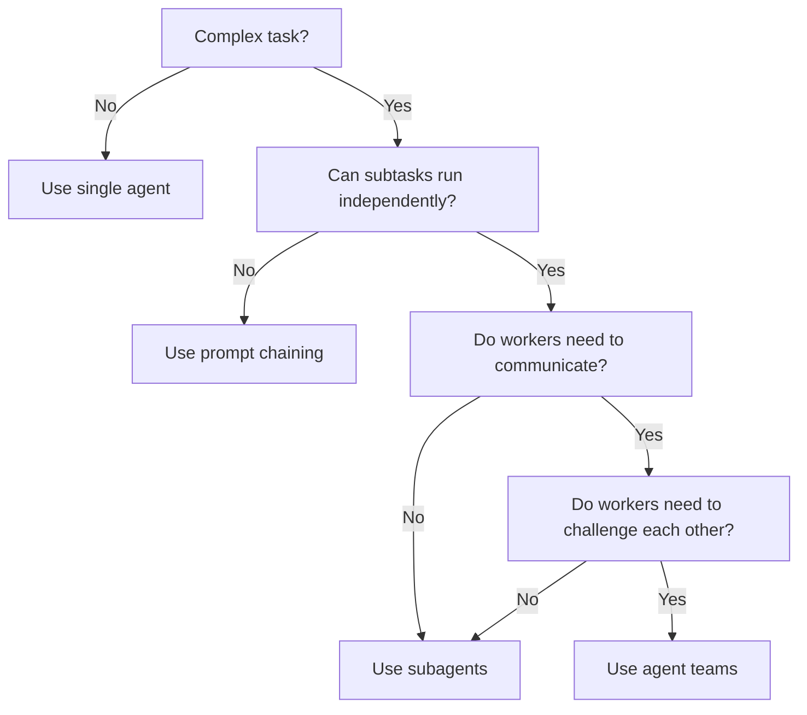
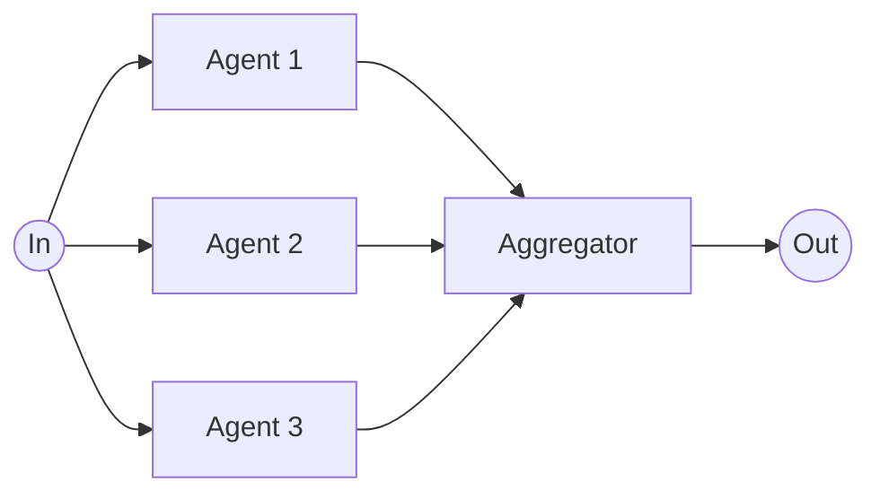
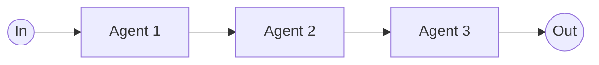
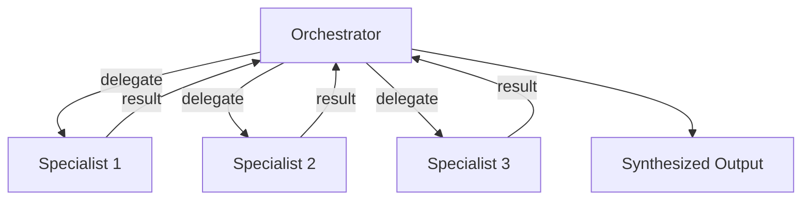
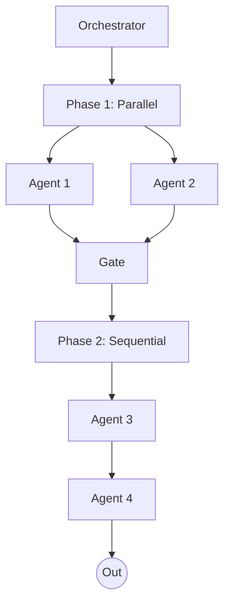
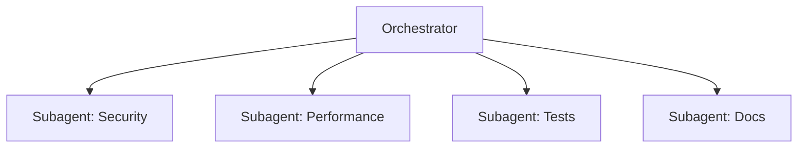

# Subagents and Agent Teams: State of the Art

> **Synthesized from:** [Building Effective Agents](https://www.anthropic.com/engineering/building-effective-agents) by Anthropic, [Claude Code Docs](https://code.claude.com/docs/en/sub-agents), [AOrchestra](https://arxiv.org/html/2602.03786v1), [AdaptOrch](https://arxiv.org/abs/2602.16873), [OpenAI Agents SDK](https://openai.github.io/openai-agents-python/), and [Google ADK](https://google.github.io/adk-docs/agents/multi-agents/).
>
> **Extends:** [Building Blocks](building-blocks-ai-agents.md) | [Building Effective Agents](building-effective-agents.md) | [Go + OpenRouter](building-agents-with-go-and-openrouter.md)

---

## Table of Contents

1. [Introduction — From Single Agent to Multi-Agent](#1-introduction--from-single-agent-to-multi-agent)
2. [Subagents: Focused Delegation](#2-subagents-focused-delegation)
3. [Agent Teams: Collaborative Multi-Agent Systems](#3-agent-teams-collaborative-multi-agent-systems)
4. [Subagents vs Agent Teams — Decision Matrix](#4-subagents-vs-agent-teams--decision-matrix)
5. [Orchestration Topologies](#5-orchestration-topologies)
6. [Framework Landscape (2026)](#6-framework-landscape-2026)
7. [Production Best Practices](#7-production-best-practices)
8. [Go Implementation Patterns for Multi-Agent](#8-go-implementation-patterns-for-multi-agent)
9. [References](#9-references)

---

## 1. Introduction — From Single Agent to Multi-Agent

The [Autonomous Agent Loop](building-effective-agents.md#agents) described in our foundational docs works well for focused tasks: a single LLM operates in a tool-use loop until it decides the work is done. But single agents hit hard limits as tasks grow:

| Limitation | Description |
|------------|-------------|
| **Context window saturation** | Long-running tasks exhaust the context window, leading to "context rot" where early information degrades. |
| **Lack of specialization** | One system prompt cannot optimally cover security review, performance analysis, and test writing simultaneously. |
| **Sequential bottleneck** | A single agent processes one step at a time; complex tasks that could be parallelized remain slow. |
| **Risk concentration** | A single agent with broad tool access is a wider attack surface than scoped specialists. |

The solution is to move from a single agent to **multiple coordinated agents**. This is a spectrum:



This document covers subagents and agent teams in depth, touching on broader multi-agent systems where relevant. It builds directly on the [Orchestrator-Workers](building-effective-agents.md#workflow-orchestrator-workers) and [Parallelization](building-effective-agents.md#workflow-parallelization) patterns from our existing docs and extends the Go implementations in [Building AI Agents with Go and OpenRouter](building-agents-with-go-and-openrouter.md).

---

## 2. Subagents: Focused Delegation

### 2.1 What is a Subagent?

A subagent is a separate agent instance spawned by a parent agent to handle a focused subtask. It runs in its own context window with a custom system prompt and specific tool access, works independently, and returns results to the caller. Subagents **do not** communicate with each other — they only report back to the parent.



### 2.2 The 4-Tuple Abstraction (AOrchestra)

The AOrchestra framework (February 2026) formalizes any agent as a unified tuple:

**Agent = `<Instruction, Context, Tools, Model>`**

| Component | Description |
|-----------|-------------|
| **Instruction** | The system prompt defining the agent's role and behavior |
| **Context** | Task-relevant information curated for this specific execution |
| **Tools** | The set of capabilities the agent can invoke |
| **Model** | The LLM powering the agent (can vary by cost/capability) |

This compositional recipe allows an orchestrator to spawn specialized subagents on demand rather than relying on static, predefined agent roles. Each subagent receives a clean working context with only the information it needs, avoiding context rot in long-horizon tasks.

**Key results:** Across three challenging benchmarks, AOrchestra achieved a **16.28% average relative improvement** over the strongest baselines, including 80.00% on GAIA and 82.00% on SWE-Bench-Verified.

### 2.3 Benefits of Subagents

| Benefit | How it works |
|---------|--------------|
| **Context isolation** | Exploration and verbose output stay in the subagent's context; only a summary returns to the parent. |
| **Parallelization** | Multiple subagents run concurrently via goroutines (Go) or async tasks, speeding up independent work. |
| **Cost control** | Route simple tasks to faster, cheaper models (e.g., Haiku for exploration, Sonnet for analysis). |
| **Specialized instructions** | Each subagent gets a focused system prompt tailored to its domain. |
| **Tool restrictions** | Subagents can be limited to specific tools, reducing the blast radius of mistakes. |

### 2.4 Implementation Approaches

#### Anthropic / Claude Code

Claude Code provides three layers of subagent definition:

**Built-in subagents:**

| Subagent | Model | Tools | Purpose |
|----------|-------|-------|---------|
| Explore | Haiku (fast) | Read-only | File discovery, code search, codebase exploration |
| Plan | Inherits | Read-only | Codebase research for planning |
| General-purpose | Inherits | All | Complex research, multi-step operations, code modifications |

**Custom subagents** are defined as Markdown files with YAML frontmatter:

```yaml
---
name: code-reviewer
description: Reviews code for quality and best practices. Use proactively after code changes.
tools: Read, Glob, Grep, Bash
model: sonnet
memory: project
---

You are a senior code reviewer. When invoked, analyze the code and provide
specific, actionable feedback on quality, security, and best practices.
```

**Scoping and priority:**

| Location | Scope | Priority |
|----------|-------|----------|
| `--agents` CLI flag | Current session | 1 (highest) |
| `.claude/agents/` | Current project | 2 |
| `~/.claude/agents/` | All projects | 3 |
| Plugin's `agents/` | Where plugin is enabled | 4 (lowest) |

**Key patterns:**
- **Isolate high-volume operations:** Delegate test runs, log analysis, or doc fetching to a subagent so verbose output stays out of main context.
- **Parallel research:** Spawn multiple subagents to investigate auth, database, and API modules simultaneously.
- **Chaining:** Use one subagent to find issues, then another to fix them, with the parent passing context between them.
- **Persistent memory:** Enable `memory: user|project|local` so subagents build knowledge across sessions.

**Constraint:** Subagents cannot spawn other subagents. If nested delegation is needed, chain subagents from the main conversation or use agent teams.

#### OpenAI Agents SDK

The Agents SDK (successor to the educational Swarm framework) uses two core primitives:

- **Agents as tools:** One agent can invoke another agent as a tool, receiving its output as a tool result.
- **Handoffs:** An agent explicitly transfers control to another agent, passing along conversation context.



The SDK adds production features missing from Swarm: built-in tracing, guardrails for input validation, persistent sessions, human-in-the-loop mechanisms, and realtime voice agents.

#### Google ADK (Agent Development Kit)

ADK organizes agents in a parent-child hierarchy with three agent types:

| Type | Role | Examples |
|------|------|----------|
| **LLM Agents** | Reasoning and decision-making | Gemini-powered analysts, planners |
| **Workflow Agents** | Orchestrate execution flow | SequentialAgent, ParallelAgent, LoopAgent |
| **Custom Agents** | Domain-specific logic | BaseAgent subclasses with custom behavior |

Each agent can have only one parent (single parent rule), creating a tree structure. Available in Python, TypeScript, Go, and Java SDKs.

---

## 3. Agent Teams: Collaborative Multi-Agent Systems

### 3.1 What is an Agent Team?

An agent team is a group of independent agent instances that communicate directly with each other, coordinate through shared task lists, and work in parallel. Unlike subagents, teammates are **peers** — they can message each other, claim tasks autonomously, and challenge each other's findings.



### 3.2 Anthropic Agent Teams Architecture

Released February 2026 alongside Claude 4.6 Opus, agent teams represent Anthropic's evolution beyond subagents.

**Core components:**

| Component | Role |
|-----------|------|
| **Team Lead** | The main Claude Code session that creates the team, spawns teammates, and coordinates work |
| **Teammates** | Separate Claude Code instances, each with their own context window |
| **Task List** | Shared list of work items with states (pending, in_progress, completed) and dependencies |
| **Mailbox** | Messaging system for direct agent-to-agent communication |

**Communication patterns:**
- **Message:** Send to one specific teammate (lateral communication like "I changed the API signature").
- **Broadcast:** Send to all teammates simultaneously (use sparingly — cost scales with team size).
- **Automatic delivery:** Messages arrive at recipients without polling.
- **Idle notifications:** When a teammate finishes, it automatically notifies the lead.

**Task coordination:**
- Tasks have three states: **pending**, **in progress**, **completed**.
- Tasks can depend on other tasks; blocked tasks cannot be claimed until dependencies resolve.
- Task claiming uses **file locking** to prevent race conditions.
- After finishing a task, a teammate self-claims the next unassigned, unblocked task.

**Quality gates:**
- **Plan approval:** Require teammates to plan before implementing. The lead reviews and approves/rejects plans with feedback.
- **TeammateIdle hook:** Runs when a teammate is about to go idle. Exit with code 2 to send feedback and keep the teammate working.
- **TaskCompleted hook:** Runs when a task is being marked complete. Exit with code 2 to prevent completion and send feedback.

**Display modes:**
- **In-process:** All teammates run inside the main terminal. Use `Shift+Down` to cycle through them.
- **Split panes:** Each teammate gets its own tmux/iTerm2 pane. Click into a pane to interact directly.

**Storage:**
- Team config: `~/.claude/teams/{team-name}/config.json`
- Task list: `~/.claude/tasks/{team-name}/`

**Token cost:** Agent teams use **3-4x more tokens** than a single session, but compress multi-hour sequential workflows into minutes through parallel execution.

### 3.3 Best Use Cases

| Use Case | Why teams work well |
|----------|-------------------|
| **Parallel code review** | Split review into security, performance, and test coverage — each reviewer applies a different lens without overlap. |
| **Competing hypothesis debugging** | Multiple investigators test different theories in parallel, actively trying to disprove each other. The surviving theory is more likely correct. |
| **Cross-layer coordination** | Frontend, backend, and test changes each owned by a different teammate. |
| **New modules/features** | Teammates each own a separate piece without stepping on each other. |
| **Research and review** | Multiple teammates investigate different aspects simultaneously, then share and challenge findings. |

### 3.4 Anti-patterns (When NOT to Use Teams)

- **Sequential tasks** with hard dependencies between every step.
- **Same-file edits** — two teammates editing the same file leads to overwrites.
- **Highly interdependent work** where every decision requires consensus.
- **Simple tasks** where coordination overhead exceeds the benefit.
- **Routine tasks** where a single well-prompted agent with good tools suffices.

### 3.5 Limitations (as of early 2026)

- No session resumption for in-process teammates (`/resume` does not restore them).
- Task status can lag — teammates sometimes fail to mark tasks completed.
- One team per session; no nested teams.
- The lead is fixed for the team's lifetime; no promotion or transfer.
- Split panes require tmux or iTerm2 (not VS Code terminal, Windows Terminal, or Ghostty).

---

## 4. Subagents vs Agent Teams — Decision Matrix

| Dimension | Subagents | Agent Teams |
|-----------|-----------|-------------|
| **Context** | Own context window; results return to caller | Own context window; fully independent |
| **Communication** | Report results back to parent only | Teammates message each other directly |
| **Coordination** | Parent manages all work | Shared task list with self-coordination |
| **Nesting** | Cannot spawn sub-subagents | Cannot spawn nested teams |
| **Token cost** | Lower: results summarized back | Higher: each teammate is a separate instance (3-4x) |
| **Best for** | Focused tasks where only the result matters | Complex work requiring discussion and collaboration |
| **Ideal count** | 1-5 concurrent | 3-5 teammates with 5-6 tasks each |

**Decision flowchart:**



**Rule of thumb:** Use subagents when you need quick, focused workers that report back. Use agent teams when teammates need to share findings, challenge each other, and coordinate on their own.

---

## 5. Orchestration Topologies

### 5.1 The Paradigm Shift

The AdaptOrch framework (February 2026) establishes a fundamental insight: as LLM performance converges across providers (GPT-4o, Claude 3.5+, Gemini 2.0 now cluster within 2-5% of each other on major benchmarks), **orchestration topology outweighs model selection** as the primary performance lever.

This means how you compose agents matters more than which model you pick.

### 5.2 Four Canonical Topologies

#### Parallel Topology

Independent subtasks run simultaneously, results aggregated.



**Best for:** Code review (security + performance + tests), research from multiple sources, voting/consensus.

See also: [Parallelization](building-effective-agents.md#workflow-parallelization) and the Go implementation in [Pattern C: Parallelization](building-agents-with-go-and-openrouter.md#pattern-c-parallelization).

#### Sequential Topology

Agents execute in a fixed pipeline, each processing the output of the previous one.



**Best for:** Document processing, content generation pipelines, multi-stage analysis.

See also: [Prompt Chaining](building-effective-agents.md#workflow-prompt-chaining) and the Go implementation in [Pattern A: Prompt Chaining](building-agents-with-go-and-openrouter.md#pattern-a-prompt-chaining).

#### Hierarchical Topology

A supervisor/coordinator orchestrates specialist agents and synthesizes their work.



**Best for:** Complex coding tasks, multi-file changes, tasks where subtasks are not known upfront. This is the most common production pattern.

See also: [Orchestrator-Workers](building-effective-agents.md#workflow-orchestrator-workers) and the Go implementation in [Pattern D: Orchestrator-Workers](building-agents-with-go-and-openrouter.md#pattern-d-orchestrator-workers).

#### Hybrid Topology

Dynamic combination of the above topologies, selected based on the task dependency graph.



**Best for:** Real-world tasks that combine independent research (parallel) with dependent implementation (sequential) and review (hierarchical).

### 5.3 Topology Routing (AdaptOrch)

AdaptOrch introduces a **topology routing algorithm** that maps a task decomposition DAG to the optimal topology in O(|V| + |E|) time, with three key contributions:

1. **Performance Convergence Scaling Law:** Formalizes when orchestration selection outweighs model selection.
2. **Topology Routing Algorithm:** Analyzes the task dependency graph to select parallel, sequential, hierarchical, or hybrid topology.
3. **Adaptive Synthesis Protocol:** Provides provable termination guarantees and consistency scoring for parallel agent outputs.

**Key result:** Topology-aware orchestration achieves **12-23% improvement** over static baselines, even when using identical underlying models. This establishes orchestration design as an independent optimization target from model scaling.

---

## 6. Framework Landscape (2026)

| Framework | Architecture | Best For | Production Readiness | Languages |
|-----------|-------------|----------|---------------------|-----------|
| **LangGraph** | Graph-driven state machine (DAG) | Complex conditional workflows, RAG, enterprise compliance | Highest (v1.0 GA) | Python, TypeScript |
| **CrewAI** | Role-based team collaboration | Rapid prototyping, MVP to production in <3 weeks | High | Python |
| **AutoGen/AG2** | Conversation-driven multi-agent | Conversational agents, human-in-the-loop dialogue | Moderate | Python |
| **OpenAI Agents SDK** | Agents-as-tools + handoffs | Production agent systems (successor to Swarm) | High | Python, TypeScript |
| **Google ADK** | Hierarchical parent-child | Multi-agent with workflow agents, multi-language teams | High | Python, TypeScript, Go, Java |
| **Claude Agent SDK** | Subagent-based, markdown-defined | Custom subagents, hooks/skills, agent teams | High | Python, TypeScript |

**Market context (2026):**
- Multi-agent AI market projected to reach **$52.62 billion by 2030** (46.3% CAGR).
- 57% of organizations run AI agents in production.
- Gartner estimates 40% of enterprise applications will feature task-specific agents by end of 2026 (up from 5% in 2025).

**Choosing a framework:**
- **Need maximum control?** LangGraph for explicit state management.
- **Need fastest time-to-value?** CrewAI for role-based teams.
- **Building on OpenAI?** Agents SDK is the production path (Swarm is now educational only).
- **Multi-language team?** Google ADK supports Python, TypeScript, Go, and Java.
- **Using Claude Code?** Claude Agent SDK with custom subagents and agent teams.
- **Building from scratch in Go?** Use the composable patterns below — no framework needed.

---

## 7. Production Best Practices

### 7.1 Simplicity First

> Approximately **70% of "multi-agent" projects can be solved better with a single well-prompted agent** with good tools. Multi-agent systems fail at rates of 41-86% in production.

Start with a single agent. Add subagents only when context isolation or parallelization demonstrably improves outcomes. Add agent teams only when peer communication is genuinely needed. This echoes the core principle from [Building Effective Agents](building-effective-agents.md#summary): "Start with simple prompts, optimize them with comprehensive evaluation, and add multi-step agentic systems only when simpler solutions fall short."

### 7.2 Strict Two-Level Architecture

Use a **flat two-level hierarchy**: one primary orchestrator with specialized subagents. Avoid deep nesting — it increases debugging difficulty, latency, and cost. Both Anthropic (subagents cannot spawn sub-subagents) and production experience confirm this constraint.



### 7.3 Bounded Autonomy

Most successful deployments limit agent autonomy:

| Risk Level | Approach |
|------------|----------|
| **Low risk** (read-only queries, analysis) | Fully automated |
| **Medium risk** (code changes, file edits) | Automated with checkpoints |
| **High risk** (refunds, emails, deployments) | Human approval required |

This maps directly to the [Feedback: Human-in-the-Loop Approval](building-agents-with-go-and-openrouter.md#step-7--feedback-human-in-the-loop-approval) pattern from our Go implementation docs.

### 7.4 Monitoring and Observability

| Practice | Description |
|----------|-------------|
| **Distributed tracing** | Trace every LLM call across all agents from day one. Use OpenRouter's `trace` field. |
| **Token accounting** | Track per-agent token consumption. Set circuit breakers for runaway costs. |
| **Quality evaluations** | Automated factuality and toxicity scoring on agent outputs. |
| **Real-time alerting** | Detect hallucinations, stalls, and anomalies. |

This extends the retry/backoff pattern from [Step 6 — Recovery](building-agents-with-go-and-openrouter.md#step-6--recovery-graceful-failure-management) to multi-agent monitoring.

### 7.5 Task Sizing

For agent teams, target **5-6 tasks per teammate**. This keeps everyone productive without excessive context switching. If you have 15 independent tasks, start with 3 teammates.

- **Too small:** Coordination overhead exceeds the benefit.
- **Too large:** Teammates work too long without check-ins, increasing wasted effort risk.
- **Just right:** Self-contained units that produce a clear deliverable (a function, a test file, a review).

### 7.6 Avoid File Conflicts

Two agents editing the same file leads to overwrites. Break work so each agent owns a **different set of files**. In agent teams, file locking helps but doesn't eliminate the need for clear ownership boundaries.

---

## 8. Go Implementation Patterns for Multi-Agent

This section extends the [Orchestrator-Workers](building-agents-with-go-and-openrouter.md#pattern-d-orchestrator-workers) and [Parallelization](building-agents-with-go-and-openrouter.md#pattern-c-parallelization) patterns from our Go implementation docs into full multi-agent patterns.

### 8.1 The SubAgent Struct (4-Tuple)

Following AOrchestra's abstraction, every agent is defined by `<Instruction, Context, Tools, Model>`:

```go
// subagent.go
package agent

import (
	"context"
	"fmt"
	"strings"
)

// SubAgent represents a specialized agent defined by the 4-tuple abstraction.
type SubAgent struct {
	Name        string
	Instruction string           // system prompt defining the agent's role
	Context     string           // task-relevant information for this execution
	Tools       *ToolRegistry    // scoped tool access
	Model       string           // e.g. "anthropic/claude-haiku-4", "anthropic/claude-sonnet-4-20250514"
	Client      *Client          // OpenRouter client (uses Model)
	MaxTurns    int              // safety limit for autonomous loops
}

// SubAgentResult holds the output from a subagent execution.
type SubAgentResult struct {
	AgentName string
	Output    string
	Err       error
	Usage     Usage
}

// Run executes the subagent autonomously until it completes or hits MaxTurns.
func (sa *SubAgent) Run(ctx context.Context, task string) SubAgentResult {
	messages := []Message{
		{Role: "system", Content: sa.Instruction},
	}

	if sa.Context != "" {
		messages = append(messages, Message{
			Role: "user",
			Content: fmt.Sprintf("Context:\n%s", sa.Context),
		})
	}

	messages = append(messages, Message{Role: "user", Content: task})

	maxTurns := sa.MaxTurns
	if maxTurns == 0 {
		maxTurns = 10
	}

	var totalUsage Usage

	for turn := 0; turn < maxTurns; turn++ {
		resp, err := sa.Client.Complete(ctx, ChatRequest{
			Messages: messages,
			Tools:    sa.Tools.Definitions(),
		})
		if err != nil {
			return SubAgentResult{AgentName: sa.Name, Err: err, Usage: totalUsage}
		}

		totalUsage.PromptTokens += resp.Usage.PromptTokens
		totalUsage.CompletionTokens += resp.Usage.CompletionTokens
		totalUsage.TotalTokens += resp.Usage.TotalTokens

		assistant := resp.Choices[0].Message

		if len(assistant.ToolCalls) == 0 {
			return SubAgentResult{
				AgentName: sa.Name,
				Output:    assistant.Content,
				Usage:     totalUsage,
			}
		}

		messages = append(messages, assistant)

		for _, tc := range assistant.ToolCalls {
			result, err := sa.Tools.Execute(ctx, tc.Function.Name, []byte(tc.Function.Arguments))
			if err != nil {
				result = fmt.Sprintf(`{"error": "%s"}`, err.Error())
			}
			messages = append(messages, Message{
				Role:       "tool",
				Content:    result,
				ToolCallID: tc.ID,
			})
		}
	}

	return SubAgentResult{
		AgentName: sa.Name,
		Err:       fmt.Errorf("subagent %s did not complete within %d turns", sa.Name, maxTurns),
		Usage:     totalUsage,
	}
}
```

### 8.2 Orchestrator with Dynamic SubAgent Spawning

The orchestrator decomposes a task, creates subagents on the fly, runs them in parallel, and synthesizes results:

```go
// orchestrator_subagents.go
package agent

import (
	"context"
	"fmt"
	"strings"
	"sync"
)

// SubAgentSpec describes a subagent to spawn (determined by the orchestrator LLM).
type SubAgentSpec struct {
	Name        string `json:"name"`
	Role        string `json:"role"`
	Task        string `json:"task"`
	ModelTier   string `json:"model_tier"` // "fast", "balanced", "capable"
}

// OrchestratorSubAgentPlan is the LLM's decomposition of work into subagent specs.
type OrchestratorSubAgentPlan struct {
	SubAgents []SubAgentSpec `json:"sub_agents"`
}

var modelTiers = map[string]string{
	"fast":     "anthropic/claude-haiku-4",
	"balanced": "anthropic/claude-sonnet-4-20250514",
	"capable":  "anthropic/claude-sonnet-4-20250514",
}

// RunWithSubAgents breaks down a task, spawns subagents, runs them in parallel,
// and synthesizes results. Extends the Orchestrator-Workers pattern.
func RunWithSubAgents(
	ctx context.Context,
	orchestratorClient *Client,
	registry *ToolRegistry,
	task string,
) (string, error) {
	planMessages := []Message{
		{
			Role: "system",
			Content: `You are an orchestrator. Break the task into independent subtasks
and assign each to a specialized sub-agent. Respond with ONLY JSON:
{
  "sub_agents": [
    {"name": "agent-name", "role": "system prompt for the agent", "task": "specific task", "model_tier": "fast|balanced|capable"}
  ]
}
Create 2-5 sub-agents. Each should be independently solvable.
Use "fast" for simple lookups, "balanced" for analysis, "capable" for complex reasoning.`,
		},
		{Role: "user", Content: task},
	}

	plan, err := ValidateAndRetry[OrchestratorSubAgentPlan](ctx, orchestratorClient, planMessages, 2)
	if err != nil {
		return "", fmt.Errorf("orchestrator planning: %w", err)
	}

	results := make([]SubAgentResult, len(plan.SubAgents))
	var wg sync.WaitGroup

	for i, spec := range plan.SubAgents {
		wg.Add(1)
		go func(idx int, s SubAgentSpec) {
			defer wg.Done()

			model := modelTiers[s.ModelTier]
			if model == "" {
				model = modelTiers["balanced"]
			}

			sa := &SubAgent{
				Name:        s.Name,
				Instruction: s.Role,
				Tools:       registry,
				Model:       model,
				Client:      NewClient(model),
				MaxTurns:    10,
			}

			results[idx] = sa.Run(ctx, s.Task)
		}(i, spec)
	}

	wg.Wait()

	var synthesis strings.Builder
	synthesis.WriteString(fmt.Sprintf("Original task: %s\n\nSubagent results:\n", task))
	for _, r := range results {
		if r.Err != nil {
			synthesis.WriteString(fmt.Sprintf("- [%s] ERROR: %v\n", r.AgentName, r.Err))
		} else {
			synthesis.WriteString(fmt.Sprintf("- [%s]: %s\n", r.AgentName, r.Output))
		}
	}

	resp, err := orchestratorClient.Complete(ctx, ChatRequest{
		Messages: []Message{
			{Role: "system", Content: "Synthesize the subagent results into a coherent final answer."},
			{Role: "user", Content: synthesis.String()},
		},
	})
	if err != nil {
		return "", fmt.Errorf("synthesis: %w", err)
	}

	return resp.Choices[0].Message.Content, nil
}
```

### 8.3 Channel-Based Inter-Agent Messaging (Agent Teams)

For agent team simulation where agents need to communicate with each other, use Go channels as a mailbox system:

```go
// team.go
package agent

import (
	"context"
	"fmt"
	"sync"
)

// AgentMessage represents a message between teammates.
type AgentMessage struct {
	From    string
	To      string // empty string = broadcast to all
	Content string
}

// TeamTask represents a task in the shared task list.
type TeamTask struct {
	ID           string
	Description  string
	Status       string // "pending", "in_progress", "completed"
	AssignedTo   string
	DependsOn    []string
	Result       string
}

// AgentTeam coordinates multiple agents with shared task list and messaging.
type AgentTeam struct {
	mu       sync.Mutex
	Lead     *SubAgent
	Members  map[string]*SubAgent
	Tasks    []*TeamTask
	Mailbox  chan AgentMessage
	done     chan struct{}
}

// NewAgentTeam creates a team with a lead and members.
func NewAgentTeam(lead *SubAgent, members map[string]*SubAgent, tasks []*TeamTask) *AgentTeam {
	return &AgentTeam{
		Lead:    lead,
		Members: members,
		Tasks:   tasks,
		Mailbox: make(chan AgentMessage, 100),
		done:    make(chan struct{}),
	}
}

// ClaimTask atomically assigns an unblocked pending task to a teammate.
func (t *AgentTeam) ClaimTask(agentName string) *TeamTask {
	t.mu.Lock()
	defer t.mu.Unlock()

	for _, task := range t.Tasks {
		if task.Status != "pending" {
			continue
		}
		if t.hasUnresolvedDeps(task) {
			continue
		}
		task.Status = "in_progress"
		task.AssignedTo = agentName
		return task
	}
	return nil
}

// CompleteTask marks a task as completed and stores the result.
func (t *AgentTeam) CompleteTask(taskID, result string) {
	t.mu.Lock()
	defer t.mu.Unlock()

	for _, task := range t.Tasks {
		if task.ID == taskID {
			task.Status = "completed"
			task.Result = result
			return
		}
	}
}

func (t *AgentTeam) hasUnresolvedDeps(task *TeamTask) bool {
	for _, depID := range task.DependsOn {
		for _, other := range t.Tasks {
			if other.ID == depID && other.Status != "completed" {
				return true
			}
		}
	}
	return false
}

// AllComplete returns true when every task is completed.
func (t *AgentTeam) AllComplete() bool {
	t.mu.Lock()
	defer t.mu.Unlock()

	for _, task := range t.Tasks {
		if task.Status != "completed" {
			return false
		}
	}
	return true
}

// RunTeam starts all teammates, each claiming and completing tasks until done.
func (t *AgentTeam) RunTeam(ctx context.Context) map[string]SubAgentResult {
	results := make(map[string]SubAgentResult)
	var mu sync.Mutex
	var wg sync.WaitGroup

	for name, member := range t.Members {
		wg.Add(1)
		go func(agentName string, sa *SubAgent) {
			defer wg.Done()

			for {
				task := t.ClaimTask(agentName)
				if task == nil {
					if t.AllComplete() {
						return
					}
					continue
				}

				result := sa.Run(ctx, task.Description)
				t.CompleteTask(task.ID, result.Output)

				t.Mailbox <- AgentMessage{
					From:    agentName,
					Content: fmt.Sprintf("Completed task %s: %s", task.ID, result.Output),
				}

				mu.Lock()
				results[task.ID] = result
				mu.Unlock()
			}
		}(name, member)
	}

	wg.Wait()
	close(t.Mailbox)
	return results
}
```

### 8.4 Context Propagation for Cascading Cancellation

When an orchestrator decides to abort, all subagents should stop immediately. Go's `context.Context` makes this natural:

```go
func RunWithTimeout(parentCtx context.Context, team *AgentTeam) (map[string]SubAgentResult, error) {
	ctx, cancel := context.WithTimeout(parentCtx, 5*time.Minute)
	defer cancel()

	resultsCh := make(chan map[string]SubAgentResult, 1)
	go func() {
		resultsCh <- team.RunTeam(ctx)
	}()

	select {
	case results := <-resultsCh:
		return results, nil
	case <-ctx.Done():
		return nil, fmt.Errorf("team execution timed out: %w", ctx.Err())
	}
}
```

All `sa.Client.Complete()` calls use the same context, so cancellation propagates through HTTP requests to every subagent's in-flight LLM call.

---

## 9. References

### Academic

| Paper | Key Contribution |
|-------|-----------------|
| [AOrchestra](https://arxiv.org/html/2602.03786v1) (Feb 2026) | 4-tuple `<Instruction, Context, Tools, Model>` abstraction for automatic sub-agent creation. 16.28% improvement over baselines. |
| [AdaptOrch](https://arxiv.org/abs/2602.16873) (Feb 2026) | Task-adaptive orchestration topology routing. 12-23% improvement with identical models. |

### Industry

| Source | Relevance |
|--------|-----------|
| [Building Effective Agents](https://www.anthropic.com/engineering/building-effective-agents) (Anthropic, Dec 2024) | Foundational workflow patterns: chaining, routing, parallelization, orchestrator-workers, evaluator-optimizer. |
| [Claude Code: Custom Subagents](https://docs.anthropic.com/en/docs/claude-code/subagents) | Full subagent configuration: frontmatter, tools, hooks, memory, skills. |
| [Claude Code: Agent Teams](https://code.claude.com/docs/en/agent-teams) | Team architecture: lead, teammates, shared tasks, mailbox messaging. |
| [OpenAI Agents SDK](https://openai.github.io/openai-agents-python/) | Production agent framework: agents-as-tools, handoffs, tracing, guardrails. |
| [Google ADK: Multi-Agent Systems](https://google.github.io/adk-docs/agents/multi-agents/) | Hierarchical parent-child agents, workflow agents (Sequential, Parallel, Loop). |

### Project Documentation

| Document | What it covers |
|----------|---------------|
| [Building Blocks](building-blocks-ai-agents.md) | The 7 foundational building blocks: intelligence, memory, tools, validation, control, recovery, feedback. |
| [Building Effective Agents](building-effective-agents.md) | Workflow patterns and the autonomous agent loop. |
| [Go + OpenRouter](building-agents-with-go-and-openrouter.md) | Go implementations of all patterns with OpenRouter API. |

---

*Built for the Leal engineering team. Extends the agent foundations in [Building Effective Agents](building-effective-agents.md) into the multi-agent dimension.*
