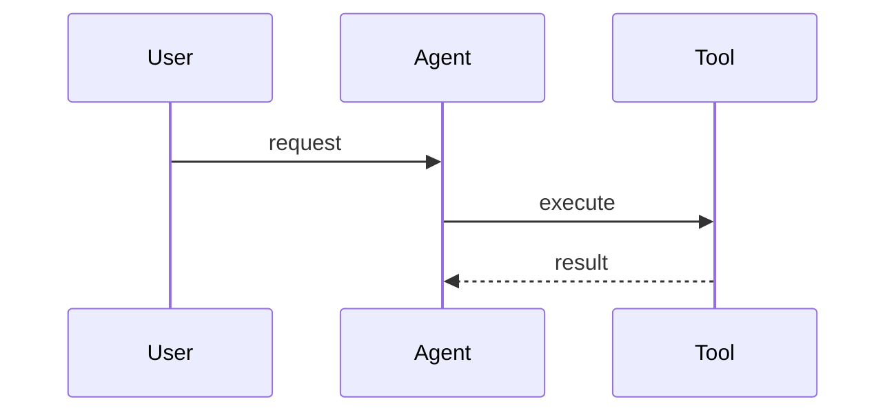

# Canonical Issue Template for New Features

This template defines the 9-section structure used in all feature issues for `liwaisi_assistant/back/go-assistant`. Every section is mandatory unless explicitly marked optional. The resulting issue should be 15,000-55,000 characters.

Reference issues that established this format: #16, #21, #25, #27.

---

## Section 1: Summary

2-3 paragraphs. First paragraph is WHAT + WHY + VALUE. Second paragraph is HOW at a high level. Optional third paragraph for additional context.

**Format rules:**
- Bold (`**keyword**`) for every key technical term, tool name, pattern name, or architecture concept on first mention
- First paragraph answers: What is being added? Why does the project need it? What value does it unlock?
- Second paragraph answers: How will it work at a high level? What patterns/libraries does it follow?
- End with a `---` horizontal rule

**Example opening pattern:**

```markdown
Add a **new `{toolset_name}` ToolSet** to the go-assistant agent with a **`{tool_name}`** tool
that {does X}. This is the foundational {capability} for giving the agent the ability to {Y}
— a critical capability for {Z}.

The implementation follows the existing `tool.Set` interface pattern, the hexagonal architecture
established across the project, and the "{philosophy}" principle of the application.
```

---

## Section 2: Motivation

Three subsections, each mandatory:

### From the Foundational Documents

Introductory sentence:

```markdown
The three reference documents in `.docs/` establish clear principles that drive this design:
```

Then 3-5 block quotes from `.docs/` files, each as:

```markdown
> *"Exact quote from the document."*
> — `.docs/{filename}.md`
```

**Rules:**
- Quotes must be exact excerpts, not paraphrased
- Each quote must be relevant to the feature being designed
- Aim for at least one quote from each of the three `.docs/` files
- Separate each quote with a blank line

### Why Now

A numbered list (5-8 items) explaining why this feature is needed now:

```markdown
1. **{Problem name}** — {1-2 sentence description of the current limitation}
2. **{Problem name}** — {description}
...
```

### Design Philosophy

3-5 bullet points connecting the feature to the project's core principles:

```markdown
- Uses `{pattern}` for {purpose} — {design justification}
- Operates within configurable guardrails ({specifics})
- Returns structured results so the agent can reason about {what}
```

End with a `---` horizontal rule.

---

## Section 3: SOTA Research (optional — skip with `--no-research`)

If research was performed, include:

### Comparison Table

| Feature / Library | Option A | Option B | Option C |
|-------------------|----------|----------|----------|
| Criterion 1       | ...      | ...      | ...      |
| Criterion 2       | ...      | ...      | ...      |
| Stars / Maturity   | ...      | ...      | ...      |

### Key Insights

Numbered list of 3-5 findings from the research.

### Our Position

1-2 paragraphs explaining which approach/library fits best for liwaisi_assistant and why.

If research was skipped, write:

```markdown
> *SOTA research skipped via `--no-research` flag.*
```

End with a `---` horizontal rule.

---

## Section 4: Architecture Decision(s)

At least one Architecture Decision section. Multiple are fine (issues #25 has three).

### Section title pattern

```markdown
## Architecture Decision: {Decision Statement}
```

### Content structure

1. **Context** — 1-2 paragraphs explaining the architectural question
2. **Comparison table** of alternatives:

| Criteria | Option A | Option B | Option C |
|----------|----------|----------|----------|
| Criterion 1 | ... | ... | ... |
| Criterion 2 | ... | ... | ... |
| **Verdict** | ... | **Selected** | ... |

3. **Decision rationale** — 1-2 paragraphs explaining why the selected option wins

End with a `---` horizontal rule.

---

## Section 5: Technical Specification

The detailed technical design. This section varies by feature but must include:

### Required elements (at least 2 of these):

- **Go struct definitions** with json tags and field documentation
- **JSON schemas** for tool parameters or API payloads
- **Interface definitions** with method signatures
- **Mermaid diagrams** (at least 1) — sequence, class, flowchart, or architecture diagram

### Common subsections (use as applicable):

- **Tool Definitions** — Tool name, description, parameters as the LLM will see them
- **Domain Model** — Entities, value objects, their relationships
- **Package Structure** — Directory tree showing new files/packages
- **Data Flow** — How data moves through the hexagonal layers
- **Configuration** — New config fields, env vars, defaults
- **CLI Commands** — New commands and their flags (if applicable)
- **Security Model** — Security boundaries, validation, sanitization

### Mermaid diagram format

````markdown

````

End with a `---` horizontal rule.

---

## Section 6: Implementation Phases

4-7 phases, each following this exact format:

```markdown
### Phase {N}: {Phase Title}

**Files to create:**

- `internal/path/to/file.go`
- `internal/path/to/file_test.go`

**Files to modify:**

- `internal/path/to/existing.go` — {what changes}

**Implementation details:**

1. {Step 1 with technical specifics}
2. {Step 2}
...

**Acceptance criteria:**
- [ ] {Specific, testable criterion}
- [ ] {Another criterion}
... (8-15 criteria per phase)
```

**Rules:**
- Each phase must be independently testable
- Later phases can depend on earlier ones
- List exact file paths (not vague "create a file")
- Acceptance criteria are checkbox items that can be verified by a reviewer
- Criteria should be specific: "X method returns Y when given Z" not "X works correctly"
- 8-15 criteria per phase, no fewer

End with a `---` horizontal rule.

---

## Section 7: Testing Strategy

### Unit Test Table

| Component | Test | Description |
|-----------|------|-------------|
| `{package.Function}` | `Test{Function}_Success` | {What it verifies} |
| `{package.Function}` | `Test{Function}_Error` | {Error scenario} |
| ... | ... | ... |

### Test Pattern Example

Show a concrete test function skeleton for the most important test:

```go
func TestFeature_Scenario(t *testing.T) {
    // Arrange
    ...
    // Act
    ...
    // Assert
    ...
}
```

### Additional Testing Subsections (as applicable)

- **Race Detection** — Note: `go test -race ./...` must pass
- **Integration Tests** — How integration points are tested
- **Coverage Target** — Must state: "Target: 80%+ line coverage for new code"
- **Mock Strategy** — Which interfaces are mocked and how

End with a `---` horizontal rule.

---

## Section 8: Out of Scope

5+ items that are explicitly NOT part of this feature. Each item:

```markdown
- **{Feature/capability name}:** {1-2 sentence justification for why it's deferred}
```

**Rules:**
- Each item must be a real capability someone might reasonably expect to be included
- Justification explains either "not needed yet", "different domain", or "future issue"
- Acts as a scope defense — prevents scope creep during implementation

End with a `---` horizontal rule.

---

## Section 9: References

Links to all cited sources, organized as a bullet list:

```markdown
- [Source title](URL) — {brief description}
- `.docs/building-blocks-ai-agents.md` — Foundational document on AI agent building blocks
- `.docs/building-effective-agents.md` — Anthropic's guide to effective agent design
- `.docs/building-agents-with-go-and-openrouter.md` — Go-specific agent patterns
- [Library name](GitHub URL) — {what it provides}
```

Include:
- All three `.docs/` files (always)
- Any web sources from SOTA research
- GitHub repos for recommended libraries
- Relevant Go documentation pages
