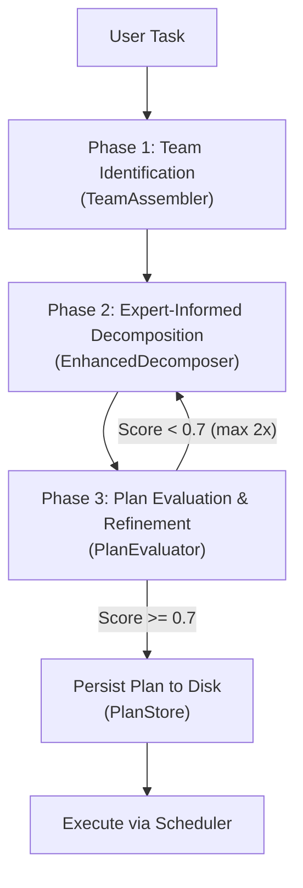

## Summary

Redesign the planner subagent to produce higher-quality execution plans through:
1. **Dynamic expert team assembly** — identify and assemble the right specialists before planning
2. **Expert-informed decomposition** — decompose tasks with input from assembled experts
3. **Evaluator-optimizer loop** — evaluate and refine plans before execution (max 2 refinement iterations)
4. **Plan persistence** — save plans as markdown files under `.liwaisi/plans/{session-id}/plan.md` with lifecycle management (`active` → `closed` / `overridden`)

## Motivation

The current planner uses a single LLM decomposition call without specialized expert input, evaluation feedback, or persistent plan files. This results in:
- Generic micro-task decompositions that miss domain-specific concerns
- No opportunity to review or iterate on plans before execution
- No audit trail of planning decisions

### Why the project documentation demands this improvement

The design of this improved planner is **driven by the foundational principles and guidelines documented in `.docs/`**:

#### From `building-blocks-ai-agents.md` — The 7 Building Blocks

> *"AI agents are simply workflows — directed acyclic graphs (DAGs) if you're being precise. Most steps in these workflows should be regular code — not LLM calls."*

The current planner violates this by making the decomposition entirely LLM-dependent without any validation or feedback loop. The improved planner adds the **Validation** building block (Phase 3: PlanEvaluator scores the plan against rubrics) and the **Feedback** building block (human can review plans before execution via `plan show` / `plan execute` separation).

> *"Making an LLM API call is the most expensive and most dangerous operation in modern software development. You want to avoid it at all costs and only use it when absolutely necessary."*

The `PlanGate` bypass for simple tasks is preserved. The evaluator loop is capped at 2 iterations to bound LLM cost. Team assembly uses existing heuristics before falling back to LLM.

#### From `building-effective-agents.md` — Evaluator-Optimizer Pattern

> *"In the evaluator-optimizer workflow, one LLM call generates a response while another provides evaluation and feedback in a loop."*

The current planner has **no evaluator**. Phase 3 (`PlanEvaluator`) directly implements this pattern — the decomposer generates, the evaluator scores and returns feedback, and the decomposer refines. This is the single most impactful missing pattern.

> *"Maintain simplicity in your agent's design. Prioritize transparency by explicitly showing the agent's planning steps."*

Plan persistence to markdown files (`plan.md`) makes the planning steps **transparent and inspectable** — the user can see the assembled team, the DAG, the evaluation score, and any refinement feedback.

#### From `subagents-and-agent-teams.md` — Multi-Agent Best Practices

> *"Approximately 70% of 'multi-agent' projects can be solved better with a single well-prompted agent with good tools."*

We don't add agent teams or inter-agent communication. We stay within the **strict two-level architecture** (§7.2): one orchestrator (the planner service) with specialized subagents. The team assembly enriches the *prompt context*, not the agent topology.

> *"Use a flat two-level hierarchy: one primary orchestrator with specialized subagents. Avoid deep nesting."*

The 3-phase pipeline is flat: each phase is one LLM call orchestrated deterministically by Go code. No sub-subagents.

> *"AOrchestra achieves a 16.28% average relative improvement"* and *"Topology-aware orchestration achieves 12-23% improvement over static baselines"*

These research results justify the investment in a richer planning pipeline. The current single-pass decomposer is a "static baseline" — adding team-informed decomposition and evaluation mirrors the improvements documented in AOrchestra and AdaptOrch.

#### From `llms.txt` — LLM Philosophy

> *"Don't think of LLMs as entities but as simulators. [...] 'What would be a good group of people to explore xyz? What would they say?'"*

This is the **exact** design philosophy behind Phase 1 (TeamAssembler). Instead of asking the LLM "what do you think the plan should be?", we ask: "What group of experts would be needed to plan this task? What would each of them contribute?" The LLM simulates expert perspectives rather than generating a single opinionated plan.

#### From `building-agents-with-go-and-openrouter.md` — Go Implementation Patterns

The improved planner reuses the existing Go patterns: `SubAgentSpec` for expert roles, `PlanGraph` for the DAG, `PlanResult` for execution outcomes. No new abstractions are introduced that break the existing type system. The Orchestrator-Workers pattern is directly applied to the 3-phase pipeline.

### What recent research confirms

| Study | Key Finding |
|-------|-------------|
| **AOrchestra** (Feb 2026) | Dynamic subagent creation via 4-tuple abstraction → 16% improvement |
| **AdaptOrch** (Feb 2026) | Topology-aware orchestration → 12-23% improvement over static decomposition |
| **ACONIC** (Oct 2025) | Constraint-based decomposition analysis → more granular task breakdown |
| **ADaPT** (Feb 2025) | As-needed decomposition with planner/executor separation |
| **Evaluator-Optimizer** (Anthropic) | Generate → Evaluate → Refine loop demonstrably improves plan quality |

## Specification

### Phase 1 — Team Identification

```
Input:  task string
Output: TeamEvaluation { NeedsTeam, Confidence, Roles []RoleSpec, Reasoning }
```

- The `TeamAssembler` analyzes the task and identifies which specialist roles are needed
- Uses the existing `TeamEvaluation` / `RoleSpec` value objects
- The LLM prompt explicitly channels expert perspectives (per `llms.txt` philosophy)
- Default minimum team: Software Architect + QA Engineer
- Task-adaptive: DevOps, UX-UI CLI Designer, Security Engineer, etc. added as needed

### Phase 2 — Expert-Informed Decomposition

```
Input:  task string, roles []RoleSpec
Output: *PlanGraph (validated DAG of MicroTasks)
```

- The `EnhancedDecomposer` enriches the decomposition prompt with each expert's perspective and constraints
- The LLM sees: original task + team roles + project architectural principles
- Produces a flat DAG optimized for parallelism

### Phase 3 — Plan Evaluation & Refinement

```
Input:  task string, roles []RoleSpec, graph *PlanGraph
Output: *PlanGraph (potentially refined), score float64, feedback string
```

- The `PlanEvaluator` scores the plan on: completeness, feasibility, granularity, risk
- If score < 0.7 → feedback is passed back to the decomposer for refinement
- Maximum 2 refinement iterations (bounded cost)

### Plan Persistence

```
Storage: .liwaisi/plans/{session-id}/plan.md
Format:  Structured Markdown
```

- Only one `active` plan per session at a time
- Before creating a new plan, any existing `active` plan must be `closed` or `overridden`
- Plan lifecycle: `active` → `closed` | `overridden`
- Plans include: task, team, DAG, evaluation score, timestamps

### CLI Interface

| Command | Description |
|---------|-------------|
| `liwaisi plan create <task>` | Assemble team → decompose → evaluate → persist |
| `liwaisi plan create <task> --execute` | Create + auto-execute |
| `liwaisi plan show [session-id]` | Display plan details |
| `liwaisi plan close [session-id]` | Close plan |
| `liwaisi plan list` | List all plan sessions |
| `liwaisi plan execute [session-id]` | Execute a persisted plan |

**Backward compat:** `liwaisi plan "task"` (no subcommand) remains as alias for `plan create --execute`.

## Architecture: 3-Phase Pipeline



## Acceptance Criteria

- [ ] `TeamAssembler` identifies >= 2 expert roles for complex tasks
- [ ] `EnhancedDecomposer` includes all team perspectives in the decomposition prompt
- [ ] `PlanEvaluator` refines plans that score below threshold (max 2 iterations)
- [ ] Plans are saved to `.liwaisi/plans/{session-id}/plan.md`
- [ ] Only one active plan per session; creating a new plan requires closing/overriding the current one
- [ ] `plan create`, `plan show`, `plan close`, `plan list`, `plan execute` subcommands work
- [ ] All existing planner tests pass without regression
- [ ] New unit tests for all new components with mocked LLM clients
- [ ] `PlanGate` still bypasses the pipeline for simple tasks (no regression)

## Non-Goals (Out of Scope)

- Agent teams with inter-agent communication (future work)
- Plan resumption after CLI restart
- Real-time plan streaming/progress during decomposition
- Nested subagent spawning

## File Changes

### New Files
| File | Layer | Purpose |
|------|-------|---------|
| `valueobject/plan_lifecycle.go` | Domain | Plan lifecycle states |
| `entity/plan_document.go` | Domain | Persisted plan entity |
| `port/output/plan_store.go` | Domain | Output port for plan I/O |
| `planner/team_assembler.go` | Application | Phase 1: team identification |
| `planner/enhanced_decomposer.go` | Application | Phase 2: expert-informed decomposition |
| `planner/plan_evaluator.go` | Application | Phase 3: evaluation & refinement |
| `filesystem/file_plan_store.go` | Infrastructure | File-based PlanStore adapter |
| + corresponding `_test.go` for each | | |

### Modified Files
| File | Changes |
|------|---------|
| `service/planner_service.go` | 3-phase pipeline, new dependencies |
| `port/input/planner_service.go` | Add `ClosePlan`, `ShowPlan`, `ListPlans` |
| `cli/commands/plan.go` | Subcommand tree |
| `root.go` / `main.go` | DI wiring |

## Architecture Alignment

| Principle (from `.docs/`) | How This Design Follows It |
|-----------|---------------------------|
| **Only use LLM when deterministic code can't solve** | `PlanGate` still bypasses LLM for simple tasks |
| **Orchestrator-Workers pattern** | The 3-phase pipeline is an orchestrator; each phase is a focused worker |
| **Evaluator-Optimizer pattern** | Phase 3 is a direct implementation (max 2 cycles) |
| **4-Tuple subagent abstraction (AOrchestra)** | Each expert role maps to `RoleSpec` → `SubAgentSpec` |
| **Strict two-level architecture** | Planner orchestrates subagents; no sub-subagents |
| **Context isolation** | Each phase has its own LLM call with focused context |
| **Bounded autonomy** | Plan approval is an explicit checkpoint before execution |
| **LLMs as simulators, not entities** (`llms.txt`) | Team assembly asks "What experts would be needed?" not "What do you think?" |

## References

- [AOrchestra](https://arxiv.org/html/2602.03786v1) — 4-tuple agent abstraction, 16% avg improvement
- [AdaptOrch](https://arxiv.org/abs/2602.16873) — Topology routing, 12-23% improvement
- [ACONIC](https://arxiv.org/abs/2410.07985) — Constraint-induced complexity decomposition
- [ADaPT](https://arxiv.org/abs/2311.05772) — As-needed decomposition and planning
- [Building Effective Agents](https://www.anthropic.com/engineering/building-effective-agents) — Evaluator-Optimizer pattern


