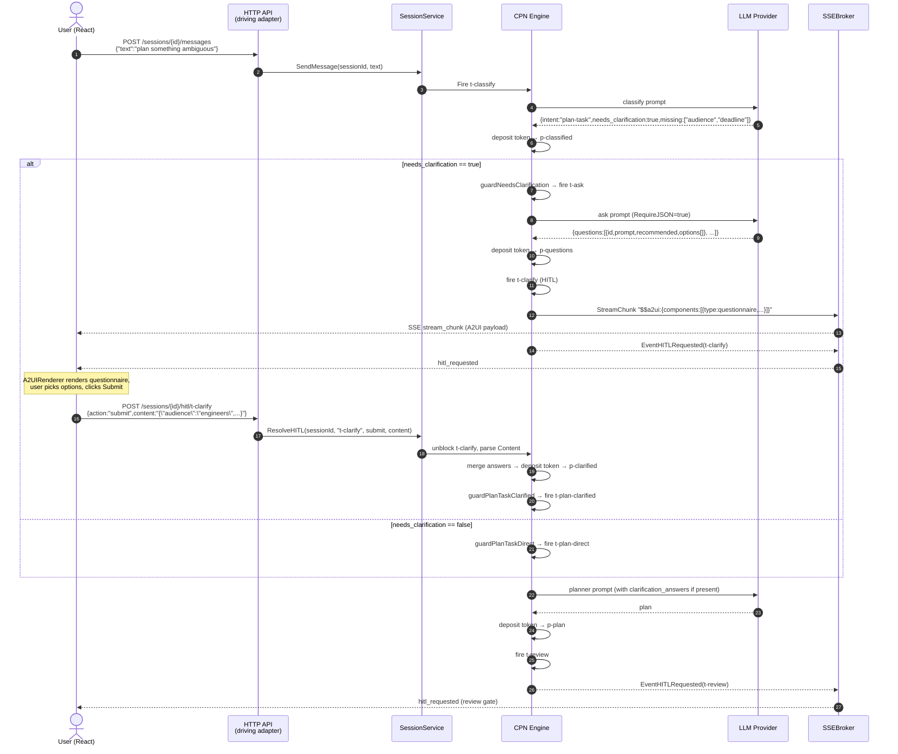

# Introduction

This specification defines the requirements for integrating the Google A2A (Agent-to-Agent) protocol v1.0 and the A2UI (Agent-to-User Interface) protocol v0.8 into the BRAE assistant platform. The A2A protocol enables BRAE to participate in multi-agent ecosystems as both a client and server, exposing its CPN-powered capabilities through a standardized interoperability layer. The A2UI protocol adds declarative UI rendering, allowing the backend agent to drive rich, interactive frontend components beyond plain text/markdown.

The integration follows BRAE's hexagonal architecture: A2A becomes a **new driving adapter** alongside the existing REST+SSE HTTP API, both sharing the same `SessionService` application layer. On the frontend, A2UI is added as a **parallel rendering path** alongside the existing `MarkdownContent` pipeline.

## 1. Purpose & Scope

**Purpose**: Enable BRAE to serve and consume A2A protocol messages, allowing external agents to discover BRAE's capabilities via AgentCard, send tasks, receive streaming responses, and interact with HITL gates. Simultaneously, enable the React frontend to render agent-driven declarative UI components via A2UI.

**Scope**:

- **Backend**: New driving adapter at `internal/driving/a2a/` implementing JSON-RPC 2.0 transport with SSE streaming. AgentCard endpoint at `/.well-known/agent-card.json`. Data model mapping between CPN types and A2A types.
- **Frontend**: A2UI SDK integration (`@a2ui-sdk/react`), dual rendering strategy (text via markdown, structured via A2UI), SSE bridge to A2UI message handler, action dispatch wired to HITL API.
- **Out of scope**: gRPC transport (optional in A2A spec, deferred), push notifications infrastructure (Phase 2), A2A client SDK for calling external agents, A2UI custom component authoring beyond catalog mapping.

**Audience**: Backend Go developers, frontend React/TypeScript developers, and platform architects.

**Assumptions**:
- The official Go SDK `github.com/a2aproject/a2a-go/v2` provides server-side JSON-RPC handling, SSE streaming, and all A2A type definitions
- The npm package `@a2ui-sdk/react` (v0.4.0, protocol v0.8) provides `A2UIProvider`, `A2UIRenderer`, `standardCatalog`, and hooks
- The existing REST+SSE API (`internal/driving/httpapi/`) continues to serve the primary React frontend unchanged
- The A2A adapter runs on the same HTTP server, sharing the `http.ServeMux` at a separate path prefix
- A2UI is in Preview (v0.8); breaking changes are expected and the integration must be abstracted

## 2. Definitions

| Term | Definition |
|------|-----------|
| **A2A** | Agent-to-Agent protocol — open standard by Google/Linux Foundation for agent interoperability over HTTP |
| **A2UI** | Agent-to-User Interface protocol — companion spec for declarative UI rendering from agents |
| **AgentCard** | JSON metadata document at `/.well-known/agent-card.json` describing agent capabilities, skills, and auth |
| **JSON-RPC 2.0** | Wire format used by A2A for request/response messaging |
| **Task** | A2A unit of work — maps to a CPN execution run within a Session |
| **Part** | A2A content unit within a Message — variants: TextPart, DataPart, RawPart, URLPart |
| **Artifact** | A2A output produced by an agent task — composed of Parts |
| **TaskState** | A2A lifecycle state: SUBMITTED, WORKING, COMPLETED, FAILED, CANCELED, REJECTED, INPUT_REQUIRED, AUTH_REQUIRED |
| **AgentExecutor** | Go interface from `a2asrv` that BRAE must implement to handle A2A requests |
| **ExecutorContext** | Context object carrying Message, TaskID, ContextID passed to AgentExecutor |
| **CPN** | Coloured Petri Net — BRAE's execution engine for agent workflows |
| **HITL** | Human-in-the-Loop — CPN transition type that blocks for human approval |
| **SSEBroker** | BRAE's existing per-session event fan-out mechanism for Server-Sent Events |
| **StreamChunk** | `cpn.StreamChunk` — delta payload `{SessionID, CPNID, CPNRole, Content, Done}` |
| **Catalog** | A2UI component registry mapping component type names to React components |
| **Skill** | A2A AgentCard concept — a declared capability with input/output modes and examples |

## 3. Requirements, Constraints & Guidelines

### Requirements — Backend (A2A Driving Adapter)

- **REQ-001**: The system MUST serve an AgentCard at `GET /.well-known/agent-card.json` dynamically generated from the personality system, tool registry, and topology factory
- **REQ-002**: The system MUST implement the `a2asrv.AgentExecutor` interface, mapping `Execute()` to `SessionService.CreateSession()` + `SendMessage()` and yielding A2A events from CPN events
- **REQ-003**: The system MUST support `message.send` (synchronous) returning a completed `Task` with artifacts
- **REQ-004**: The system MUST support `message.stream` (SSE streaming) yielding `TaskStatusUpdateEvent` and `TaskArtifactUpdateEvent` as CPN events fire
- **REQ-005**: The system MUST support `tasks.get` mapping to `SessionService.GetSession()` with task/artifact reconstruction
- **REQ-006**: The system MUST support `tasks.list` with cursor-based pagination over user sessions
- **REQ-007**: The system MUST support `tasks.cancel` mapping to `SessionService.DeleteSession()` (context cancellation)
- **REQ-008**: The system MUST map CPN states to A2A TaskStates: `StateIdle`→`SUBMITTED`, `StateRunning`→`WORKING`, `StateWaiting`→`INPUT_REQUIRED`, `StateCompleted`→`COMPLETED`, `StateFailed`→`FAILED`
- **REQ-009**: The system MUST map CPN `EventStreamChunk` to A2A `TaskArtifactUpdateEvent` with `append=true` and `lastChunk` set when `StreamChunk.Done=true`
- **REQ-010**: The system MUST map CPN `EventHITLRequested` to A2A `TaskStatusUpdateEvent` with state `INPUT_REQUIRED` and the HITL prompt as a TextPart in the status message
- **REQ-011**: The system MUST handle A2A `message.send` with state `INPUT_REQUIRED` as a HITL resolution, routing the user's message to `Session.ResolveHITL()`
- **REQ-012**: The AgentCard MUST declare `capabilities.streaming: true` and list CPN topologies as skills with appropriate input/output modes
- **REQ-013**: The system MUST support `tasks.resubscribe` for SSE reconnection on an existing task
- **REQ-014**: The A2A adapter MUST reuse the existing `SessionService` without modifications to the application layer interface

### Requirements — Frontend (A2UI Integration)

- **REQ-015**: The frontend MUST install and configure `@a2ui-sdk/react` with an `A2UIProvider` wrapping the chat component tree
- **REQ-016**: The frontend MUST implement a dual rendering strategy: `TextPart` content renders through the existing `MarkdownContent` pipeline; `DataPart` content with A2UI descriptors renders through `A2UIRenderer`
- **REQ-017**: The frontend MUST bridge SSE `stream_chunk` events to `useA2UIMessageHandler().processMessage()` when the chunk payload contains A2UI component descriptors
- **REQ-018**: The frontend MUST wire `useDispatchAction()` to the existing HITL resolve API (`POST /sessions/{id}/hitl/{transitionId}`) for interactive A2UI components
- **REQ-019**: The frontend MUST provide a custom catalog mapping A2UI standard components to BRAE's design system (dark theme `--bg-deep/#0a0a0f`, cyan accent `--accent/#0ea5e9`, JetBrains Mono for code)
- **REQ-020**: The frontend MUST maintain full backward compatibility — sessions that produce only text content MUST render identically to the current behavior
- **REQ-021**: The frontend MUST abstract A2UI behind an adapter layer (`hooks/useA2UIAdapter.ts`) to isolate the application from A2UI SDK breaking changes

### Requirements — AgentCard

- **REQ-022**: The AgentCard MUST include `supportedInterfaces` with the JSON-RPC binding URL and protocol version
- **REQ-023**: The AgentCard MUST declare `securitySchemes` matching the existing Google OAuth Bearer token authentication
- **REQ-024**: The AgentCard MUST list skills derived from registered CPN topologies with `id`, `name`, `description`, `tags`, `examples`, and supported `inputModes`/`outputModes`
- **REQ-025**: The AgentCard `version` field MUST reflect the BRAE build version from `GET /api/v1/version`

### Security Requirements

- **SEC-001**: The A2A JSON-RPC endpoint MUST enforce the same authentication middleware as the REST API (Google OAuth Bearer token verification)
- **SEC-002**: The AgentCard endpoint (`/.well-known/agent-card.json`) MUST be publicly accessible without authentication (per A2A spec)
- **SEC-003**: Task operations MUST enforce session ownership — a user can only access tasks from their own sessions
- **SEC-004**: A2UI component descriptors received from the backend MUST be validated against the registered catalog — unknown component types MUST be rejected (prevent UI injection)
- **SEC-005**: The A2A adapter MUST NOT expose internal CPN topology details (place IDs, transition IDs, token payloads) in A2A responses unless explicitly mapped to A2A artifacts

### Constraints

- **CON-001**: The CPN domain layer (`cpn/`) MUST NOT import A2A SDK types. All mapping occurs in the adapter layer (`internal/driving/a2a/`)
- **CON-002**: The existing REST+SSE API (`internal/driving/httpapi/`) MUST NOT be modified. The A2A adapter is additive only
- **CON-003**: The `SessionService` interface in `internal/app/` MUST NOT change. The A2A adapter translates between A2A types and existing `SessionService` methods
- **CON-004**: The frontend MUST NOT replace the existing SSE connection (`useSSE.ts`) with an A2A client SDK. The React app continues using the REST API; A2UI is a rendering enhancement only
- **CON-005**: A2UI SDK is v0.8 Preview — the integration MUST be behind a feature flag (`ENABLE_A2UI=true` env var on backend, `localStorage` flag on frontend) allowing graceful degradation
- **CON-006**: The Go A2A SDK (`a2a-go/v2`) requires Go 1.24.4+ — verify project Go version compatibility
- **CON-007**: The A2A adapter MUST share the same `http.ServeMux` and listen address as the REST API — no separate server process

### Guidelines

- **GUD-001**: Use the official `a2a-go/v2` SDK types and handlers rather than reimplementing JSON-RPC parsing. Wrap `a2asrv.NewJSONRPCHandler()` for the transport layer
- **GUD-002**: Map CPN `Token.Payload` to A2A Parts using a type-switch adapter: `string`→`TextPart`, `[]byte`→`RawPart`, `map/struct`→`DataPart`, artifact URLs→`URLPart`
- **GUD-003**: For A2UI, prefer extending the existing `MessageBubble` component with a conditional A2UI render path over creating a separate component tree
- **GUD-004**: Use `iter.Seq2[a2a.Event, error]` (Go iterators) for the `AgentExecutor.Execute()` return type as required by the SDK
- **GUD-005**: Keep A2A task IDs as composite keys: `{sessionID}:{executionIndex}` to support multiple task executions within a single session context
- **GUD-006**: For the A2UI custom catalog, extend `standardCatalog` rather than replacing it — override only components that need BRAE theming
- **GUD-007**: Use `useDeferredValue()` for A2UI rendering during streaming to maintain the same performance characteristics as the markdown pipeline

### Patterns

- **PAT-001**: Adapter Bridge — `internal/driving/a2a/mapper.go` contains all CPN↔A2A type conversions. No A2A types leak into `internal/app/` or `cpn/`
- **PAT-002**: Event Iterator — `AgentExecutor.Execute()` subscribes to `SessionService.SetEventCallback()` and yields A2A events via a channel-to-iterator bridge
- **PAT-003**: Dual Renderer — `MessageBubble` checks message metadata for A2UI content flag; renders via `A2UIRenderer` or `MarkdownContent` accordingly
- **PAT-004**: Feature Flag Guard — both backend (`a2a.Enabled()` config check) and frontend (`useFeatureFlag("a2ui")`) gate the new code paths

## 4. Interfaces & Data Contracts

### 4.1 AgentCard (Generated)

```json
{
  "name": "BRAE",
  "description": "AI assistant powered by Coloured Petri Net execution engine",
  "version": "0.1.0",
  "provider": {
    "organization": "liwaisi-tech",
    "url": "https://liwaisi.com"
  },
  "supportedInterfaces": [
    {
      "url": "https://api.liwaisi.com/a2a",
      "protocolBinding": "JSONRPC",
      "protocolVersion": "1.0"
    }
  ],
  "capabilities": {
    "streaming": true,
    "pushNotifications": false,
    "extendedAgentCard": false
  },
  "securitySchemes": {
    "google_oauth": {
      "type": "oauth2",
      "flows": {
        "authorizationCode": {
          "authorizationUrl": "https://accounts.google.com/o/oauth2/auth",
          "tokenUrl": "https://oauth2.googleapis.com/token",
          "scopes": {
            "openid": "OpenID Connect",
            "email": "Email address",
            "profile": "User profile"
          }
        }
      }
    }
  },
  "securityRequirements": [["google_oauth"]],
  "defaultInputModes": ["text/plain"],
  "defaultOutputModes": ["text/plain", "application/json"],
  "skills": [
    {
      "id": "unified",
      "name": "Intelligent Conversation & Task Execution",
      "description": "Automatically classifies input as conversation or task. Conversations get direct responses; tasks get planned, reviewed by human, then executed.",
      "tags": ["conversation", "task", "planning", "hitl"],
      "examples": [
        "Hello, how are you?",
        "Create a plan to build a REST API",
        "Teach me about design patterns"
      ],
      "inputModes": ["text/plain"],
      "outputModes": ["text/plain", "application/json"]
    },
    {
      "id": "simple",
      "name": "Direct LLM Conversation",
      "description": "Single LLM call with streaming response. No classification or planning.",
      "tags": ["conversation", "simple"],
      "inputModes": ["text/plain"],
      "outputModes": ["text/plain"]
    },
    {
      "id": "hitl",
      "name": "Plan-Review-Execute with Human Gate",
      "description": "Plans a response, pauses for human approval, then executes. Always requires HITL.",
      "tags": ["planning", "hitl", "review"],
      "inputModes": ["text/plain"],
      "outputModes": ["text/plain"]
    }
  ]
}
```

### 4.2 AgentExecutor Implementation

```go
// internal/driving/a2a/executor.go
package a2a

import (
    "context"
    "iter"

    a2atypes "github.com/a2aproject/a2a-go/v2/a2a"
    "github.com/a2aproject/a2a-go/v2/a2asrv"

    "github.com/liwaisi-tech/liwaisi_assistant/back/go-assistant/internal/app"
    "github.com/liwaisi-tech/liwaisi_assistant/back/go-assistant/cpn"
)

// BRAEExecutor implements a2asrv.AgentExecutor, bridging A2A requests
// to the BRAE SessionService.
type BRAEExecutor struct {
    sessions *app.SessionService
    mapper   *Mapper
}

func (e *BRAEExecutor) Execute(
    ctx context.Context,
    execCtx *a2asrv.ExecutorContext,
) iter.Seq2[a2atypes.Event, error] {
    return func(yield func(a2atypes.Event, error) bool) {
        // 1. Extract or create session from execCtx.ContextID
        sessionID := e.mapper.ContextIDToSessionID(execCtx.ContextID)
        userContent := e.mapper.PartsToString(execCtx.Message.Parts)

        // 2. Emit WORKING status
        taskInfo := e.mapper.NewTaskInfo(execCtx)
        if !yield(a2atypes.NewStatusUpdateEvent(taskInfo, a2atypes.TaskStateWorking, nil), nil) {
            return
        }

        // 3. Wire CPN event callback to yield A2A events
        eventCh := make(chan a2atypes.Event, 64)
        e.sessions.SetEventCallbackForSession(sessionID, func(sid string, evt cpn.Event) {
            a2aEvt := e.mapper.CPNEventToA2AEvent(taskInfo, evt)
            if a2aEvt != nil {
                eventCh <- a2aEvt
            }
        })

        // 4. Send message (triggers CPN execution)
        _ = e.sessions.SendMessage(ctx, sessionID, userContent)

        // 5. Drain events until CPN completes
        for evt := range eventCh {
            if !yield(evt, nil) {
                return
            }
        }
    }
}

func (e *BRAEExecutor) Cancel(
    ctx context.Context,
    execCtx *a2asrv.ExecutorContext,
) iter.Seq2[a2atypes.Event, error] {
    return func(yield func(a2atypes.Event, error) bool) {
        sessionID := e.mapper.ContextIDToSessionID(execCtx.ContextID)
        _ = e.sessions.DeleteSession(sessionID)
        taskInfo := e.mapper.NewTaskInfo(execCtx)
        yield(a2atypes.NewStatusUpdateEvent(taskInfo, a2atypes.TaskStateCanceled, nil), nil)
    }
}
```

### 4.3 CPN → A2A Type Mapper

```go
// internal/driving/a2a/mapper.go
package a2a

import (
    a2atypes "github.com/a2aproject/a2a-go/v2/a2a"
    "github.com/liwaisi-tech/liwaisi_assistant/back/go-assistant/cpn"
)

type Mapper struct{}

// StateToA2A maps CPN state to A2A TaskState.
func (m *Mapper) StateToA2A(s cpn.State) a2atypes.TaskState {
    switch s {
    case cpn.StateIdle:
        return a2atypes.TaskStateSubmitted
    case cpn.StateRunning:
        return a2atypes.TaskStateWorking
    case cpn.StateWaiting:
        return a2atypes.TaskStateInputRequired
    case cpn.StateCompleted:
        return a2atypes.TaskStateCompleted
    case cpn.StateFailed:
        return a2atypes.TaskStateFailed
    default:
        return a2atypes.TaskStateWorking
    }
}

// TokenPayloadToPart converts a CPN token payload to an A2A Part.
func (m *Mapper) TokenPayloadToPart(payload any) *a2atypes.Part {
    switch v := payload.(type) {
    case string:
        return a2atypes.NewTextPart(v)
    case []byte:
        return a2atypes.NewRawPart(v)
    default:
        return a2atypes.NewDataPart(v)
    }
}

// CPNEventToA2AEvent converts a CPN event to an A2A streaming event.
func (m *Mapper) CPNEventToA2AEvent(
    taskInfo a2atypes.TaskInfoProvider,
    evt cpn.Event,
) a2atypes.Event {
    switch evt.Type {
    case cpn.EventStreamChunk:
        chunk, ok := evt.Payload.(*cpn.StreamChunk)
        if !ok {
            return nil
        }
        part := a2atypes.NewTextPart(chunk.Content)
        if chunk.Done {
            e := a2atypes.NewArtifactUpdateEvent(taskInfo, "main", part)
            e.LastChunk = true
            e.Append = false
            return e
        }
        e := a2atypes.NewArtifactUpdateEvent(taskInfo, "main", part)
        e.Append = true
        e.LastChunk = false
        return e

    case cpn.EventHITLRequested:
        prompt, _ := evt.Payload.(string)
        msg := a2atypes.NewMessage(a2atypes.RoleAgent, a2atypes.NewTextPart(prompt))
        return a2atypes.NewStatusUpdateEvent(taskInfo, a2atypes.TaskStateInputRequired, msg)

    case cpn.EventHITLResolved:
        return a2atypes.NewStatusUpdateEvent(taskInfo, a2atypes.TaskStateWorking, nil)

    case cpn.EventTransitionCompleted:
        // No direct A2A mapping — internal execution detail
        return nil

    default:
        return nil
    }
}

// MessageToA2A converts a CPN Message to an A2A Message.
func (m *Mapper) MessageToA2A(msg cpn.Message) *a2atypes.Message {
    role := a2atypes.RoleUser
    if msg.Role == cpn.RoleAssistant {
        role = a2atypes.RoleAgent
    }
    return a2atypes.NewMessage(role, a2atypes.NewTextPart(msg.Content))
}
```

### 4.4 A2A Handler Registration

```go
// internal/driving/a2a/server.go
package a2a

import (
    "net/http"

    a2atypes "github.com/a2aproject/a2a-go/v2/a2a"
    "github.com/a2aproject/a2a-go/v2/a2asrv"

    "github.com/liwaisi-tech/liwaisi_assistant/back/go-assistant/internal/app"
)

// RegisterHandlers mounts A2A protocol endpoints on the given mux.
func RegisterHandlers(
    mux *http.ServeMux,
    sessions *app.SessionService,
    card *a2atypes.AgentCard,
) {
    executor := &BRAEExecutor{
        sessions: sessions,
        mapper:   &Mapper{},
    }

    handler := a2asrv.NewHandler(executor,
        a2asrv.WithCapabilityChecks(&a2atypes.AgentCapabilities{
            Streaming: true,
        }),
    )

    jsonrpcHandler := a2asrv.NewJSONRPCHandler(handler)

    // A2A JSON-RPC endpoint
    mux.Handle("/a2a", jsonrpcHandler)

    // AgentCard discovery endpoint (public, no auth)
    mux.HandleFunc("GET /.well-known/agent-card.json", func(w http.ResponseWriter, r *http.Request) {
        w.Header().Set("Content-Type", "application/json")
        w.Header().Set("Cache-Control", "public, max-age=300")
        json.NewEncoder(w).Encode(card)
    })
}
```

### 4.5 Composition Root Wiring

```go
// cmd/server/main.go — additions (pseudocode)

// Build AgentCard from existing registries
if cfg.EnableA2A {
    agentCard := a2a.BuildAgentCard(personality, toolRegistry, topologyNames, buildVersion)
    a2a.RegisterHandlers(mux, appService, agentCard)
    slog.Info("A2A protocol adapter registered", "path", "/a2a")
}
```

### 4.6 Frontend: A2UI Adapter Hook

```typescript
// src/hooks/useA2UIAdapter.ts
import { useCallback, useMemo } from 'react';

// Adapter layer to isolate A2UI SDK specifics
// When A2UI updates from v0.8 to v1.0, only this file changes

export interface A2UIAdapterResult {
  isA2UIContent: (content: string) => boolean;
  parseA2UIPayload: (content: string) => A2UIPayload | null;
  renderMode: 'markdown' | 'a2ui' | 'hybrid';
}

export interface A2UIPayload {
  components: unknown[];  // A2UI component descriptors
  data?: Record<string, unknown>;
}

const A2UI_MARKER = '$$a2ui:';

export function useA2UIAdapter(enabled: boolean): A2UIAdapterResult {
  const isA2UIContent = useCallback((content: string) => {
    if (!enabled) return false;
    return content.startsWith(A2UI_MARKER);
  }, [enabled]);

  const parseA2UIPayload = useCallback((content: string): A2UIPayload | null => {
    if (!enabled || !content.startsWith(A2UI_MARKER)) return null;
    try {
      return JSON.parse(content.slice(A2UI_MARKER.length));
    } catch {
      return null;
    }
  }, [enabled]);

  return useMemo(() => ({
    isA2UIContent,
    parseA2UIPayload,
    renderMode: enabled ? 'hybrid' as const : 'markdown' as const,
  }), [isA2UIContent, parseA2UIPayload, enabled]);
}
```

### 4.7 Frontend: Custom Catalog

```typescript
// src/features/chat/a2ui/catalog.ts
import { standardCatalog } from '@a2ui-sdk/react/0.8';

// Extend standard catalog with BRAE design system overrides
export const braeCatalog = {
  ...standardCatalog,
  // Override button to use BRAE cyan accent
  // Override card to use --bg-surface
  // Override text fields to use --bg-input
  // Override code blocks to use existing CodeBlock component
};
```

### 4.8 Frontend: Dual Renderer in MessageBubble

```tsx
// src/features/chat/MessageBubble.tsx — additions (pseudocode)
import { A2UIRenderer } from '@a2ui-sdk/react/0.8';
import { useA2UIAdapter } from '../../hooks/useA2UIAdapter';

function MessageBubble({ message }: Props) {
  const a2ui = useA2UIAdapter(featureFlags.a2ui);
  const payload = a2ui.parseA2UIPayload(message.content);

  if (payload) {
    return (
      <div className={bubbleClass}>
        <A2UIRenderer
          components={payload.components}
          data={payload.data}
          onAction={handleA2UIAction}
        />
      </div>
    );
  }

  // Existing markdown rendering path (unchanged)
  return (
    <div className={bubbleClass}>
      <MarkdownContent content={message.content} isStreaming={message.isStreaming} />
    </div>
  );
}
```

### 4.9 SSE Event Format — A2A Streaming

```
// A2A SSE stream (JSON-RPC envelope)
data: {"jsonrpc":"2.0","id":1,"result":{"taskStatusUpdate":{"taskId":"sess-123:0","contextId":"sess-123","status":{"state":"TASK_STATE_WORKING","timestamp":"2026-04-05T10:00:00.000Z"}}}}

data: {"jsonrpc":"2.0","id":1,"result":{"taskArtifactUpdate":{"taskId":"sess-123:0","contextId":"sess-123","artifact":{"parts":[{"text":"Hello"}]},"append":true,"lastChunk":false}}}

data: {"jsonrpc":"2.0","id":1,"result":{"taskArtifactUpdate":{"taskId":"sess-123:0","contextId":"sess-123","artifact":{"parts":[{"text":", how can I help?"}]},"append":true,"lastChunk":true}}}

data: {"jsonrpc":"2.0","id":1,"result":{"taskStatusUpdate":{"taskId":"sess-123:0","contextId":"sess-123","status":{"state":"TASK_STATE_COMPLETED","timestamp":"2026-04-05T10:00:05.000Z"},"final":true}}}
```

## 5. Acceptance Criteria

### Backend

- **AC-001**: Given a GET request to `/.well-known/agent-card.json`, When no authentication is provided, Then the response MUST be 200 with a valid AgentCard JSON containing skills derived from registered topologies
- **AC-002**: Given a JSON-RPC `message.send` request with valid auth, When the CPN completes successfully, Then the response MUST contain a Task with state `TASK_STATE_COMPLETED` and artifacts containing the assistant's response as TextParts
- **AC-003**: Given a JSON-RPC `message.stream` request, When the CPN streams LLM output, Then SSE events MUST be emitted as `taskArtifactUpdate` with `append=true` for each chunk and `lastChunk=true` on the final chunk
- **AC-004**: Given a CPN in `StateWaiting` (HITL gate), When streaming, Then a `taskStatusUpdate` with state `TASK_STATE_INPUT_REQUIRED` MUST be emitted with the HITL prompt as the status message
- **AC-005**: Given a task in `INPUT_REQUIRED` state, When a `message.send` is received for that context, Then the message MUST be routed to `Session.ResolveHITL()` and the task MUST transition to `TASK_STATE_WORKING`
- **AC-006**: Given a `tasks.cancel` request, When the CPN is running, Then the context MUST be canceled and a `TASK_STATE_CANCELED` status MUST be returned
- **AC-007**: Given a `tasks.get` request with `historyLength=5`, Then the response MUST contain the last 5 messages from the session as A2A Messages with correct roles
- **AC-008**: The A2A adapter MUST NOT cause regressions in any existing REST API endpoint — all current tests MUST pass unchanged

### Frontend

- **AC-009**: Given A2UI is disabled (feature flag off), When a message arrives, Then rendering MUST be identical to the current behavior — no A2UI SDK code loaded
- **AC-010**: Given A2UI is enabled and a message contains A2UI component descriptors, When rendered, Then the A2UIRenderer MUST display the components using the BRAE custom catalog
- **AC-011**: Given A2UI is enabled and a message contains plain text, When rendered, Then the existing MarkdownContent pipeline MUST handle rendering (dual path works)
- **AC-012**: Given an A2UI component dispatches an action, When the action maps to a HITL transition, Then the action MUST call `POST /sessions/{id}/hitl/{transitionId}` with the appropriate payload
- **AC-013**: Given A2UI rendering during streaming, When chunks arrive rapidly, Then `useDeferredValue()` MUST prevent frame drops below 30fps

## 6. Test Automation Strategy

### Test Levels

| Level | Backend | Frontend |
|-------|---------|----------|
| **Unit** | `internal/driving/a2a/mapper_test.go` — all type conversions | `useA2UIAdapter.test.ts` — parsing, feature flag |
| **Unit** | `internal/driving/a2a/executor_test.go` — mock SessionService | `MessageBubble.test.tsx` — dual render path |
| **Integration** | `internal/driving/a2a/server_test.go` — full JSON-RPC round-trip | `ChatContainer.test.tsx` — SSE→A2UI flow |
| **Integration** | AgentCard endpoint — verify valid JSON structure | A2UI catalog — verify BRAE themed components render |
| **E2E** | JSON-RPC `message.stream` → SSE events → task completion | Full chat with A2UI components (Playwright) |

### Backend Test Framework
- Go standard `testing` package
- `net/http/httptest` for HTTP handler tests
- Mock `SessionService` interface for unit isolation
- Table-driven tests for mapper conversions (all CPN states, token payload types)

### Frontend Test Framework
- Vitest for unit/integration tests
- React Testing Library for component tests
- Mock SSE via `EventSource` polyfill in tests
- Playwright for E2E (if configured)

### Coverage Requirements
- Mapper: 100% branch coverage (all state/type mappings)
- Executor: 90%+ line coverage
- Frontend adapter hook: 100% branch coverage
- Frontend dual renderer: both paths tested

## 7. Rationale & Context

### Why A2A?
The A2A protocol positions BRAE in the emerging multi-agent ecosystem. As agents from different providers need to collaborate, A2A provides the standardized handshake. BRAE's CPN engine is more powerful than what A2A models (hierarchical execution, typed tokens, sub-nets), but projecting BRAE's capabilities into A2A makes them discoverable and consumable by external agents.

### Why A2UI?
Currently BRAE renders all responses as markdown text. A2UI enables the agent to drive rich, interactive UI — forms for HITL approval, data tables, cards, progress indicators — without the frontend team hardcoding each interaction pattern. The agent decides what to show; the SDK renders it.

### Why dual adapter (not replace REST)?
1. The React frontend is optimized for the REST+SSE API. Rewriting it for A2A JSON-RPC adds complexity with no user benefit.
2. A2A is for agent-to-agent interoperability. The React app is a human-facing client — REST is more natural.
3. Running both in parallel maximizes compatibility: humans use REST, agents use A2A.

### Why feature flags?
A2UI is v0.8 Preview. Coupling tightly to a preview SDK risks breaking the production frontend when the SDK changes. Feature flags allow gradual rollout and instant rollback.

### Why `a2a-go/v2` SDK instead of manual JSON-RPC?
The official SDK handles JSON-RPC parsing, SSE formatting, method routing, error codes, and type safety. Reimplementing this is error-prone and creates maintenance burden when the spec evolves.

## 8. Dependencies & External Integrations

### External Systems

- **EXT-001**: A2A Protocol Specification v1.0 — the normative reference for all wire formats and behaviors. Source: https://a2a-protocol.org/latest/specification/
- **EXT-002**: A2UI Protocol Specification v0.8 — the normative reference for component descriptors and rendering. Source: https://a2ui.org

### Third-Party Services

- **SVC-001**: No new external services required. A2A/A2UI are protocol standards, not cloud services.

### Infrastructure Dependencies

- **INF-001**: Same HTTP server — A2A shares the existing `http.ServeMux` and listen address. No new infrastructure.

### Technology Platform Dependencies

- **PLT-001**: Go SDK — `github.com/a2aproject/a2a-go/v2` — requires Go 1.24.4+. Current project Go version must be verified and potentially upgraded.
- **PLT-002**: React SDK — `@a2ui-sdk/react` v0.4.0 (protocol v0.8) — requires React 18+ (project uses React 19, compatible).
- **PLT-003**: TypeScript types — `@a2ui-sdk/types` — companion types package for A2UI.
- **PLT-004**: Utilities — `@a2ui-sdk/utils` — string interpolation and path utilities for A2UI.

### Internal Dependencies

- **INT-001**: `internal/app/SessionService` — the application layer consumed by both REST and A2A adapters
- **INT-002**: `cpn/` domain types — Token, Event, Session, State, StreamChunk — mapped to A2A types in the adapter
- **INT-003**: Personality system — contributes to AgentCard generation (name, description, identity)
- **INT-004**: Tool Registry (`cpn/tools/Registry`) — contributes skills and input/output modes to AgentCard
- **INT-005**: Existing middleware — auth, CORS, logging, recovery — reused by A2A endpoint

## 9. Examples & Edge Cases

### Example: Full A2A message.stream round-trip

```bash
# 1. Discover agent
curl https://api.liwaisi.com/.well-known/agent-card.json

# 2. Send streaming message
curl -N -X POST https://api.liwaisi.com/a2a \
  -H "Content-Type: application/json" \
  -H "Authorization: Bearer <google-jwt>" \
  -d '{
    "jsonrpc": "2.0",
    "id": 1,
    "method": "message.stream",
    "params": {
      "message": {
        "messageId": "msg-001",
        "role": "ROLE_USER",
        "parts": [{"text": "Create a plan to build a REST API"}]
      }
    }
  }'

# SSE stream:
# → taskStatusUpdate: WORKING
# → taskArtifactUpdate: "Here" (append)
# → taskArtifactUpdate: " is my" (append)
# → taskArtifactUpdate: " plan..." (append, lastChunk)
# → taskStatusUpdate: INPUT_REQUIRED (HITL gate)
#    message: "Please review the plan above. Approve or reject?"

# 3. Approve HITL
curl -X POST https://api.liwaisi.com/a2a \
  -H "Content-Type: application/json" \
  -H "Authorization: Bearer <google-jwt>" \
  -d '{
    "jsonrpc": "2.0",
    "id": 2,
    "method": "message.send",
    "params": {
      "message": {
        "messageId": "msg-002",
        "role": "ROLE_USER",
        "parts": [{"text": "Approved"}],
        "taskId": "sess-123:0"
      }
    }
  }'

# → Task with COMPLETED state and execution artifacts
```

### Edge Case: SSE Reconnection

```
Client connects → receives chunks → network drop
Client calls tasks.resubscribe with taskId
Server resumes streaming from current CPN state
If CPN already completed: immediate COMPLETED status
If CPN still running: resume artifact updates
```

### Edge Case: Concurrent REST and A2A on Same Session

Both adapters share `SessionService`. If a user sends a message via REST while an A2A client has a streaming connection to the same session, both will receive events from the SSEBroker. This is by design — the SSEBroker already supports multiple clients per session.

### Edge Case: A2UI Content During Streaming

```
Chunk 1: "$$a2ui:{\"components\":[{\"type\":\"progress\","
Chunk 2: "\"props\":{\"value\":0.5}}]}"
```

The A2UI adapter MUST buffer until a complete JSON payload is received. Partial A2UI payloads fall back to markdown rendering until complete.

### Edge Case: Unknown A2UI Component Type

```json
{"components": [{"type": "unknown_widget", "props": {}}]}
```

If a component type is not in the catalog, the `A2UIRenderer` MUST render a fallback placeholder (not crash). Log a warning for observability.

## 10. Validation Criteria

### Backend Validation

1. `go test ./internal/driving/a2a/...` passes with 90%+ coverage
2. AgentCard endpoint returns valid JSON matching A2A v1.0 AgentCard schema
3. JSON-RPC round-trip: `message.send` → Task with COMPLETED state
4. JSON-RPC streaming: `message.stream` → SSE events in correct order (WORKING → artifacts → COMPLETED)
5. HITL flow: WORKING → INPUT_REQUIRED → (user input) → WORKING → COMPLETED
6. Existing REST API tests pass unchanged (`go test ./internal/driving/httpapi/...`)
7. No import of `a2a-go` types in `cpn/` or `internal/app/` packages

### Frontend Validation

1. `npm run test` passes with A2UI adapter tests
2. Feature flag off: zero A2UI code in production bundle (tree-shaken)
3. Feature flag on: A2UI components render with BRAE theme
4. Dual renderer: text messages → markdown, A2UI messages → A2UIRenderer
5. HITL action dispatch: A2UI button → API call → HITL resolved
6. No regressions in existing chat flow (visual snapshot tests if available)

## 11. Related Specifications / Further Reading

- [spec-architecture-block20-llm-streaming.md](spec-architecture-block20-llm-streaming.md) — LLM streaming through CPN, SSE event format
- [spec-architecture-tools-engine-agent-personality.md](spec-architecture-tools-engine-agent-personality.md) — Personality system, tool registry
- [spec-architecture-google-oauth-login.md](spec-architecture-google-oauth-login.md) — Authentication flow used by A2A security schemes
- [spec-design-sse-streaming-bugfixes.md](spec-design-sse-streaming-bugfixes.md) — SSE broker implementation details
- [A2A Protocol Specification v1.0](https://a2a-protocol.org/latest/specification/)
- [A2A Go SDK](https://github.com/a2aproject/a2a-go)
- [A2A JavaScript SDK](https://github.com/a2aproject/a2a-js)
- [A2UI Protocol](https://a2ui.org)
- [A2UI React SDK](https://github.com/google/A2UI)
- [@a2ui-sdk/react npm](https://www.npmjs.com/package/@a2ui-sdk/react)

## 12. Questionnaire & Choice components

This section specifies the `questionnaire` / `choice` A2UI component types and the
clarification CPN node (`t-ask` → `t-clarify`) that drives them. The clarification node
sits between `p-classified` and `t-plan` on the plan-task branch of the unified topology
and is skipped when the classifier is confident.

### 12.1 A2UI component schemas

Both component types extend the existing A2UI `Component` envelope (`{type, props,
children?}`) declared in §6 of this spec. The catalog adds two entries; no other
component shape is changed.

#### 12.1.1 `questionnaire`

A container that groups one or more `choice` children, holds local answer state, and
dispatches a single `hitl:submit` action when the user clicks the submit button.

```json
{
  "type": "questionnaire",
  "props": {
    "id": "string (required) — MUST equal the HITL transition id (e.g. \"t-clarify\")",
    "submitLabel": "string (optional) — button label, default \"Submit\""
  },
  "children": "Choice[] (required, length >= 1) — only `choice` components are valid children"
}
```

Validation rules:
- `props.id` MUST be a non-empty string. The frontend uses it as the `componentId` of
  the dispatched action and as the `{transitionId}` path segment of the HITL POST.
- `children` MUST contain only objects whose `type === "choice"`. Renderers MUST drop
  any other child type and log a warning (consistent with §9 "Unknown A2UI Component
  Type").
- The submit button MUST remain disabled until every child `choice.props.id` has an
  entry in the local answer state.

#### 12.1.2 `choice`

A single multiple-choice question with an optional recommended option.

```json
{
  "type": "choice",
  "props": {
    "id": "string (required) — question id, unique within the parent questionnaire",
    "label": "string (required) — question prompt shown to the user",
    "recommended": "string (optional) — id of the option to highlight with a \"Recommended\" badge",
    "options": [
      {
        "id": "string (required) — option id, unique within this choice",
        "label": "string (required) — option label shown to the user"
      }
    ]
  }
}
```

Validation rules:
- `props.options` MUST contain at least two entries.
- If `props.recommended` is present, it MUST match an `options[].id`. If it does not,
  renderers MUST ignore the field (no badge) rather than fail.
- `choice` is a leaf component — it MUST NOT declare `children`.

### 12.2 HITL resolve contract — `action: "submit"`

The clarification flow reuses the existing HITL POST endpoint
(`POST /api/v1/sessions/{sessionId}/hitl/{transitionId}`) and the existing
`ResolveHITLRequest{Action, Content}` wire shape declared in §6. No new endpoint, no
new request fields.

A new `Action` value `"submit"` is introduced alongside the existing `approve`,
`reject`, and `revise` values. Backward compatibility is preserved: handlers that do
not recognise `submit` MUST return HTTP 400 (the existing default branch).

`Content` semantics for `Action: "submit"`:

- MUST be a JSON-stringified object of shape `{[questionId: string]: optionId: string}`.
- The map MUST contain exactly one entry per `choice.props.id` that appeared in the
  questionnaire payload emitted by `t-clarify`. Missing keys cause the transition to
  reject the resolve with `ErrInvalidHITLContent`.
- Unknown keys (not present in the original questionnaire) MUST cause the same
  rejection — the backend treats the answer map as a closed set.
- Option ids MUST match one of the `options[].id` values declared for that question.

On successful resolve, `t-clarify` deposits a `ColorJSON` token into `p-clarified`
whose payload is the original classified JSON merged with:

```json
{ "clarification_answers": { "<questionId>": "<optionId>", "...": "..." } }
```

The merge is shallow and additive — existing classifier fields (`intent`,
`needs_clarification`, `missing`, etc.) are preserved verbatim so downstream
transitions can still inspect them.

#### 12.2.1 Verbatim HTTP example

Assume `sessionId = "sess-9f3a"`, the questionnaire emitted by `t-clarify` contained
two questions (`audience` and `deadline`), and the user selected
`audience = "engineers"` and `deadline = "this-week"`.

```http
POST /api/v1/sessions/sess-9f3a/hitl/t-clarify HTTP/1.1
Host: brae.liwaisi.tech
Authorization: Bearer <google-oauth-id-token>
Content-Type: application/json

{
  "action": "submit",
  "content": "{\"audience\":\"engineers\",\"deadline\":\"this-week\"}"
}
```

Successful response (HTTP 200):

```json
{
  "session_id": "sess-9f3a",
  "transition_id": "t-clarify",
  "resolved": true
}
```

Note that `content` is a **string** (JSON-stringified by the frontend), not a nested
JSON object. This matches the existing wire contract for the `revise` action and keeps
`ResolveHITLRequest` schema-stable.

### 12.3 CPN wiring — split `t-plan` (single-Guard pattern)

The clarification node introduces two new places and three new transitions on the
plan-task branch:

| Node            | Kind            | Color    | Space        | Purpose                                                          |
|-----------------|-----------------|----------|--------------|------------------------------------------------------------------|
| `p-questions`  | Place           | JSON     | Surface      | Carries the LLM-generated questionnaire spec                      |
| `p-clarified`  | Place           | JSON     | Surface      | Carries classified payload merged with `clarification_answers`    |
| `t-ask`        | Transition LLM  | —        | —            | Generates `{questions:[...]}` JSON from `missing[]` hints         |
| `t-clarify`    | Transition HITL | —        | —            | Streams A2UI questionnaire chunk, blocks for `submit`             |
| `t-plan-direct`| Transition LLM  | —        | —            | High-confidence path: consumes `p-classified`, deposits `p-plan` |
| `t-plan-clarified` | Transition LLM | —     | —            | Clarified path: consumes `p-clarified`, deposits `p-plan`        |

#### 12.3.1 Why two parallel `t-plan` transitions instead of a join

The Coloured Petri Net runtime in `cpn/transition.go` declares `Guard` as a single
function on the `Transition` struct (one transition, one boolean predicate). There is
no native support for either:

- a guard expression that can switch on **which input place** supplied the consumed
  token, or
- a non-trivial join that fires when *any* of N input places contains a token (the
  default Petri-Net firing rule requires *all* input places to be marked).

A naive single `t-plan` with both `p-classified` and `p-clarified` as inputs would
therefore wait until **both** places held tokens — which never happens, since the
classifier deposits into exactly one branch per request. Adding multi-input "OR-join"
semantics to the engine is out of scope for this change and would touch every
transition.

The chosen pattern instead duplicates the planner transition into two siblings that
share the same executor behaviour but differ only in their input place and guard:

- `t-plan-direct`: input `p-classified`, guard
  `intent == "plan-task" && needs_clarification == false`, output `p-plan`.
- `t-plan-clarified`: input `p-clarified`, guard `true` (the token has already been
  through clarification), output `p-plan`.

Both transitions deposit into the **same** `p-plan` place, so downstream
(`t-review` → `t-execute`) is unchanged. The two siblings are mutually exclusive by
construction: a token can only exist in one of `p-classified` or `p-clarified` for a
given request, so exactly one sibling fires. This keeps the change additive — no edits
to `cpn/transition.go`, no new core primitives — at the cost of one duplicated
transition definition in `cmd/server/topologies.go`.

### 12.4 Classifier contract — additive guard fields

The `t-classify` system prompt is extended so its JSON output includes two new
fields. Both are **optional and additive**: existing classifier outputs that omit them
remain valid, and `guardNeedsClarification` treats absent fields as `false`.

```json
{
  "intent": "plan-task | direct-conversation",
  "needs_clarification": "bool (optional, default false)",
  "missing": "string[] (optional, default []) — names of underspecified parameters"
}
```

Guard predicates:

- `guardNeedsClarification(token) := intent == \"plan-task\" && needs_clarification == true && len(missing) > 0`
- `guardPlanTaskDirect(token)     := intent == \"plan-task\" && needs_clarification == false`
- `guardPlanTaskClarified(token)  := true` (input is `p-clarified`, already filtered)

Backward compatibility note: existing topology tests that assert
`intent == "plan-task"` flows directly to `t-plan` continue to pass because such
fixtures emit no `needs_clarification` field, which the guard reads as `false`,
selecting `t-plan-direct`.

### 12.5 End-to-end sequence



The diagram makes the conditional branch on `needs_clarification` explicit: the
`alt`/`else` block contains the entire `t-ask` → `t-clarify` → `t-plan-clarified`
sub-sequence, while the `else` arm collapses directly to `t-plan-direct`. Both arms
re-converge at `p-plan` and continue through the existing `t-review` → `t-execute`
tail of the unified topology.

### 12.6 Open items (TBD during implementation)

- **A2UI buffering threshold for streamed `$$a2ui:` chunks** — §9 mandates buffering
  partial payloads, but the maximum buffer size before fallback to markdown is not
  fixed. To be tuned during implementation against real `t-clarify` payloads.
- **Recommended-badge accessibility token** — exact ARIA labelling for the
  "Recommended" highlight is delegated to the `/frontend-design` skill pass.

